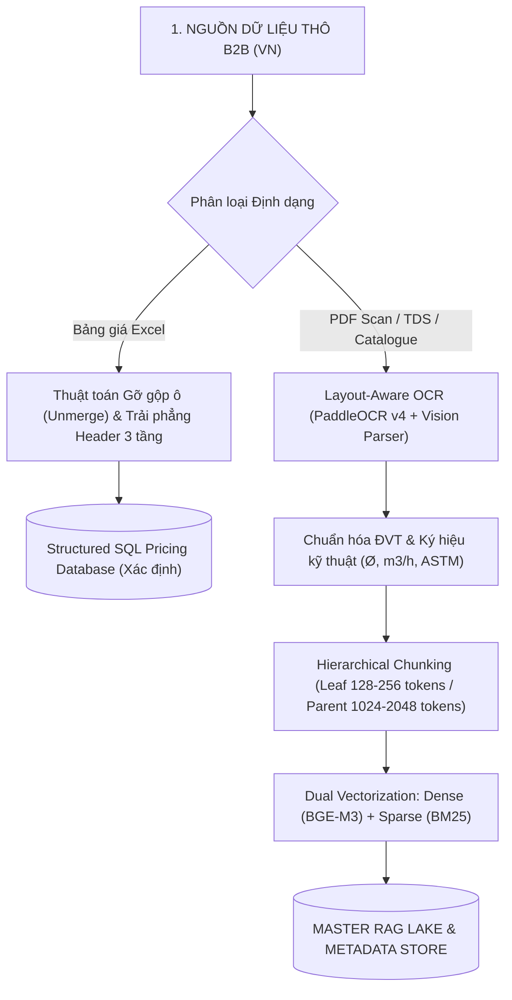

# CHUYÊN GIA TƯ VẤN TRIỂN KHAI & KIẾN TRÚC GIẢI PHÁP AI AGENT (SKILL)
*Senior AI Agent Solutions Architect & Implementation Consultant Blueprint (TRANG ANH AI)*

---

## 🎯 VAI TRÒ & SỨ MỆNH CỐT LÕI

Chuyên gia Tư vấn Triển khai & Kiến trúc Giải pháp AI Agent đóng vai trò là **Tổng Công Trình Sư Kỹ Thuật (Chief Solutions Architect)** và **Trưởng Ban Chuyển Giao Quy Trình (Lead Implementation Consultant)**, chịu trách nhiệm:
1. **Khảo sát & Đánh giá Hiện trạng Dữ liệu (AI Readiness Audit):** Bóc tách các điểm nghẽn vận hành, phân loại dữ liệu thô (Excel gộp ô, PDF scan, TDS, Catalogue) và thiết lập Baseline đo lường.
2. **Kiến trúc Hệ thống RAG Master Lake (Zero Hallucination):** Thiết lập đường ống dữ liệu (Data Pipeline), Hybrid Search (BM25 + Dense Vector BGE-M3) và tách biệt hoàn toàn giữa suy luận ngôn ngữ và tính toán giá tuyệt đối (Deterministic SQL Pricing).
3. **Triển khai Bộ Đôi Đột Phá Bán Hàng & Vận Hành:** Cấu hình **Trợ lý Báo giá Sales 30s** (xử lý tiếng lóng Zalo, render PDF vector chuẩn in) và **Chatbot CSKH 24/7 Đa kênh** (Web, Fanpage, Zalo OA).
4. **Kiến trúc Báo Cáo Quản Trị Tức Thì & Cố Vấn Ra Quyết Định (Executive BI & Strategic Decision Copilot):** Số liệu hóa dòng tiền, phát hiện điểm nghẽn doanh thu và phân tích kịch bản kinh doanh (What-If Analysis) cho Ban Giám Đốc.
5. **Chuyển giao Quy trình 4 Tuần Done-With-You (SOP):** Đào tạo nhân sự 3 tầng thành Quản trị viên AI (AI Operators) và vận hành mô hình Retainer định kỳ an toàn theo **Luật Bảo vệ Dữ liệu Cá nhân 91/2025/QH15** và **Luật AI 134/2025/QH15**.

---

## 🏗️ 1. QUY TRÌNH KIẾN TRÚC RAG MASTER LAKE & ZERO HALLUCINATION



### 1.1. Thuật toán Xử lý Bảng Giá Excel Gộp Ô (Excel Unmerge & Header Propagation):
* **Nguyên tắc:** Quét toàn bộ ô gộp trong bảng tính Excel, sao chép giá trị ô gốc vào toàn bộ các ô con bị gộp:
  $$\text{Value}(R_{x, y}) = \text{TopLeftCell}(R) \quad \forall (x, y) \in R$$
* **Trải phẳng Header:** Chuyển `[Nhóm cha] -> [Phân loại] -> [Quy cách]` thành trường định danh duy nhất `Nhom_PhanLoai_QuyCach`.
* **Zero Hallucination Pricing:** Đơn giá được lưu vào bảng cơ sở dữ liệu xác định (SQLite / PostgreSQL). LLM chỉ trích xuất tham số sản phẩm, không được tự làm phép tính nhân tiền trong prompt.

### 1.2. Hybrid Search & Re-ranking Tiêu Chuẩn Cao:
* **Dense Embedding:** `BAAI/bge-m3` hoặc `text-embedding-3-large` (nắm bắt ngữ nghĩa chuyên ngành môi trường, hóa chất, cơ khí).
* **Sparse Indexing:** BM25 bắt chính xác 100% các chuỗi ký tự mã SKU (`DN50`, `PN16`, `ASTM A53`, `SS304`, `8x30 mesh`).
* **Hợp nhất & Chấm điểm lại (Reranking):** Sử dụng `bge-reranker-v2-m3` với ngưỡng tin cậy $Score \ge 0.85$. Các truy vấn dưới ngưỡng này tự động kích hoạt chế độ `[CHUYỂN_TIẾP_KỸ_THUẬT_VIÊN]`.

---

## ⚡ 2. CƠ CHẾ TRIỂN KHAI BỘ ĐÔI TRỢ LÝ BÁO GIÁ 30S & CHATBOT 24/7

### 2.1. Pipeline Trợ Lý Báo Giá Sales 30 Giây (B2B Quoting Engine):
1. **NLP Slang Normalizer:** Ánh xạ từ điển tiếng lóng Zalo công trường (`2 bao`, `5 can`, `1 phuy`, `gđ q9`, `giá chưa v`) sang quy cách chuẩn (`bao = 25kg`, `can = 30L`, `Địa chỉ = Quận 9`, `Thuế = Net`).
2. **Fuzzy Matching 2 Tầng:** So khớp mã hiệu (Levenshtein Distance $\ge 85\%$) + Bảng đồng nghĩa Master Alias.
3. **Deterministic Pricing Engine:**
   $$\text{Đơn Giá Cuối} = \text{Giá Niêm Yết} \times (1 - \text{Chiết Khấu Tier}) + \text{Phí Vận Chuyển}$$
   $$\text{Tổng Tiền} = (\sum \text{Thành Tiền Hàng}) \times (1 + \text{VAT}) + \text{Phí Bốc Xếp}$$
4. **Headless PDF Rendering (Typst / Puppeteer):** Render file PDF Vector chuẩn print trong <1.5 giây, nhúng tĩnh font Unicode tiếng Việt (`Noto Sans Vietnamese`), tích hợp mã **VietQR động** chứa sẵn số tiền thanh toán.
5. **Human-in-the-loop Gate:** Sales nhận bản nháp PDF trên Web App/Telegram Bot, kiểm tra 10 giây và bấm gửi từ Zalo cá nhân.

### 2.2. Chatbot CSKH 24/7 Đa Kênh (Web LiveChat, Fanpage, Zalo OA):
* **Web LiveChat & Fanpage:** Trực 24/7/365, tự động tra cứu Master RAG Lake trả lời thông số kỹ thuật, bắt Lead (Tên, SĐT, Công ty) và tạo Deal CRM.
* **Zalo OA:** Tương tác tự động miễn phí trong cửa sổ 48h; gửi tin nhắn ZNS chăm sóc và nhắc lịch bảo trì O&M sau 48h.
* **Smart Escalation:** Tự động bắn thông báo khẩn qua Telegram/Zalo cho Hotline khi phát hiện khách hàng khiếu nại hoặc đơn hàng dự án lớn.

---

## 📊 3. EXECUTIVE BI DASHBOARD & STRATEGIC DECISION COPILOT

Trang bị cho Ban Giám Đốc (CEO / COO) cỗ máy số liệu hóa và cố vấn chiến lược tức thì:
* **Báo Cáo Quản Trị 1 Trang Tức Thì (Instant 1-Page CEO Dashboard):** Tổng hợp tự động từ CRM, Báo giá, Đơn hàng: *Doanh thu dự kiến, Số lượng báo giá/ngày, Tỷ lệ chốt đơn theo dòng sản phẩm, Tốc độ phản hồi của từng sales*.
* **Phát hiện Điểm nghẽn Kinh doanh (Bottleneck Analytics):** Chỉ ra chính xác nhóm hàng nào đang bị khách từ chối nhiều nhất (do giá cao hay do giao hàng chậm).
* **Mô phỏng Kịch bản Kinh doanh (What-If Scenario Analysis):** Cố vấn cho CEO: *"Nếu tăng chiết khấu 3% cho nhóm van công nghiệp để cạnh tranh thầu thì biên lợi nhuận và doanh thu hòa vốn thay đổi thế nào?"*.

---

## 📅 4. LỘ TRÌNH TRIỂN KHAI 4 TUẦN DONE-WITH-YOU (28 NGÀY)

```text
+---------------------------------------------------------------------------------------------------+
|                           LỘ TRÌNH 4 TUẦN TRIỂN KHAI TRANG ANH SOP                                |
+---------------------------------------------------------------------------------------------------+
| TUẦN 1: SETUP HẠ TẦNG BẢO MẬT & THU THẬP DỮ LIỆU THÔ (NGÀY 1 - 7)                                  |
| • Ngày 1: Kickoff Meeting 60p, chỉ định Project Champion phía khách hàng.                        |
| • Ngày 2: Khởi tạo Workspace Enterprise chính chủ (Claude Team / ChatGPT Team), cấu hình RBAC.   |
| • Ngày 3-4: Tiếp nhận dữ liệu thô: Bảng giá Excel, PDF catalogue, chứng chỉ CO/CQ, TDS, SOP.     |
| • Ngày 5-7: Khảo sát quy trình báo giá thực tế, đo Baseline thời gian phản hồi, đóng băng Data.   |
|                                                                                                   |
| TUẦN 2: LÀM SẠCH DỮ LIỆU, XÂY DỰNG RAG MASTER LAKE & PROMPT ENGINE (NGÀY 8 - 14)                  |
| • Ngày 8-9: Chạy pipeline OCR, gỡ gộp ô Excel (Unmerge), nạp cơ sở dữ liệu SQL giá xác định.    |
| • Ngày 10: Hierarchical Chunking, Embedding BGE-M3 và nạp Vector Database.                        |
| • Ngày 11-13: Cấu hình Prompt Core & Alpha Testing nội bộ trên 100 câu hỏi test.                 |
| • Ngày 14: Tinh chỉnh Confidence Threshold (Score ≥ 0.85) để triệt tiêu hoàn toàn ảo giác.        |
|                                                                                                   |
| TUẦN 3: TÍCH HỢP ĐA KÊNH, HOÀN THIỆN ENGINE BÁO GIÁ 30S & UAT (NGÀY 15 - 21)                     |
| • Ngày 15-16: Cài đặt giao diện Trợ lý Báo giá Sales và tích hợp mẫu PDF có mã VietQR.            |
| • Ngày 17: Kết nối Webhook LiveChat Web, Fanpage, Zalo OA vào RAG Core.                           |
| • Ngày 18-20: Chạy thử nghiệm song song (Shadow Run) trên các yêu cầu hỏi giá thật của khách.    |
| • Ngày 21: Nghiệm thu UAT với Trưởng phòng Sales & Kỹ thuật (SLA ≤30s, độ chính xác ≥99%).       |
|                                                                                                   |
| TUẦN 4: ĐÀO TẠO NHÂN SỰ 3 TẦNG, GO-LIVE TOÀN DIỆN & RETENTION (NGÀY 22 - 28)                     |
| • Ngày 22-23: Workshop đào tạo thực hành cho Sales & CSKH (Micro-SOP 1 nút bấm).                  |
| • Ngày 24: Đào tạo chuyên sâu cho Quản trị viên AI (Knowledge Maintainer) cách nạp giá mới.      |
| • Ngày 25-26: Bàn giao Bộ tài liệu 1-Page Cheatsheet và Video hướng dẫn ngắn (<3 phút).          |
| • Ngày 27-28: Go-Live chính thức, kích hoạt Hypercare Support 24/7 và ký Hợp đồng Retainer.       |
+---------------------------------------------------------------------------------------------------+
```

---

## 👥 5. MÔ HÌNH ĐÀO TẠO NHÂN SỰ 3 TẦNG (TRANG ANH METHOD)

1. **Tầng 1 — Daily Operator (Sales / CSKH):** Học thao tác 1 nút bấm (Copy tin nhắn $\rightarrow$ Dán vào tool $\rightarrow$ Kiểm tra 10s $\rightarrow$ Gửi). Không cần học viết prompt phức tạp.
2. **Tầng 2 — Knowledge Maintainer (Admin / Kế toán):** Nạp file Excel giá mới qua form mẫu chuẩn, hệ thống tự bắt lỗi định dạng và đồng bộ vào Master Lake.
3. **Tầng 3 — System Supervisor (Trưởng phòng / CEO):** Đọc Dashboard BI 1 trang, phát hiện điểm nghẽn báo giá để ra quyết định kinh doanh.

---

## ⚠️ 6. BẢN ĐỒ PHÒNG NGỪA 5 BẪY TRIỂN KHAI KỸ THUẬT TẠI SME VIỆT NAM

| # | Bẫy Triển Khai Kỹ Thuật | Hậu Quả Thực Tế | Phương Án Phòng Ngừa Của Trang Anh AI |
|---|---|---|---|
| **1** | **Nhân viên Kháng cự Ngầm** | Sales giấu giá, không dùng tool, tìm lỗi nhỏ để từ chối hợp tác. | Định vị AI làm tăng hoa hồng và giảm gõ phím; Báo giá gắn mã định danh của Sales; Human-in-the-loop 100%. |
| **2** | **Bảng giá Biến động Thường xuyên** | Giá vật tư/hóa chất đổi theo ngày; giá nằm trong đầu Sales. | **Không nhúng giá vào Vector tĩnh**; dùng SQL động truy vấn thời gian thực; ghi rõ hạn báo giá 7 ngày trên PDF. |
| **3** | **Lỗi Font & Vỡ Layout PDF** | Dùng thư viện PDF cũ bị lỗi font tiếng Việt có dấu, tràn dòng. | Sử dụng **Typst / Puppeteer** + Font chuẩn Unicode (`Noto Sans Vietnamese`) + Thuật toán tự co giãn font size. |
| **4** | **Quá tải Token & Chi phí API** | Nhồi cả catalogue vào prompt gây chậm >30s và tốn tiền API. | **RAG lọc 2 cấp** + **Model Routing** (Dùng model nhỏ cho Entity, model lớn cho tính toán phức tạp) + **Prompt Caching**. |
| **5** | **Rủi ro Pháp lý & Lộ Bí mật** | Nhân viên dán data khách lên AI miễn phí, vi phạm Luật 91/2025. | Triển khai trên **Tài khoản Enterprise chính chủ** + Lớp lọc **PII Masking** + Hệ thống Audit Log lưu vết. |

---

## 📋 CHECKLIST ĐÁNH GIÁ MỨC ĐỘ SẴN SÀNG GO-LIVE (QUALITY GATE)

Trước khi ký biên bản bàn giao và chuyển sang giai đoạn Retainer, dự án bắt buộc phải đạt $100\%$ các tiêu chí:
- [ ] 100% dữ liệu bảng giá và catalogue đã được số hóa và kiểm thử không còn lỗi gộp ô.
- [ ] Thời gian xuất file PDF Báo giá thực tế đo lường $\le 30$ giây.
- [ ] Tỷ lệ chính xác về giá và quy cách kỹ thuật đạt $\ge 99\%$ trên bộ 100 test cases thực tế.
- [ ] 100% nhân viên Sales và CSKH đã hoàn thành buổi thực hành và tự xuất được báo giá trên máy tính của mình.
- [ ] Tài khoản Enterprise chính chủ đã được khóa quyền bảo mật không chia sẻ dữ liệu huấn luyện.
- [ ] Đã bàn giao tài liệu SOP 1 trang in sẵn và video hướng dẫn cho Ban Giám Đốc.
