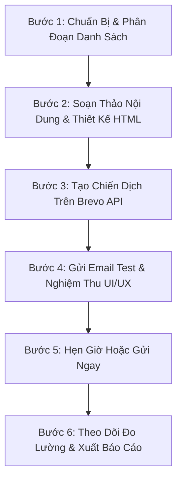

# Brevo Email Marketing Automation & Campaign Management (SKILL)

## 1. Mục Đích & Khả Năng Cốt Lõi
Skill này cung cấp quy trình chuẩn hóa và bộ công cụ tự động hóa kết nối trực tiếp với **Brevo REST API v3** (`https://api.brevo.com/v3`) để triển khai các chiến dịch Email Marketing B2B cho thương hiệu **thanhoattinh.net** (Công ty TNHH Môi Trường Xuyên Việt).

### Các năng lực cốt lõi:
1. **Chuẩn bị nội dung Email B2B (Content Preparation)**:
   - Viết nội dung chuẩn hóa nhận diện thương hiệu (`Green 600 #1B5E43`, `Green 800 #0E2C20`, `Red 500 #D2342A`, `Mint 300 #7FE3B0`).
   - Hỗ trợ HTML Email Responsive hiển thị tối ưu trên Desktop, Gmail App, Apple Mail, Outlook.
   - Cá nhân hóa linh hoạt: `{{ contact.FIRSTNAME }}`, `{{ contact.COMPANY }}`, `{{ contact.CITY }}`.
   - Tích hợp link Hủy đăng ký bắt buộc: `{{ unsubscribe }}` và link xem trên trình duyệt `{{ mirror }}`.
2. **Quản lý Danh Sách & Phân Khúc (Lists & Segments)**:
   - Đồng bộ danh sách khách hàng theo từng phân khúc ICP:
     - Nhóm A: Nhà máy sản xuất nước giải khát, bia, dược phẩm, dệt nhuộm, xi mạ.
     - Nhóm B: Đơn vị tổng thầu EPC / Nhà thầu M&E / Kỹ sư thiết kế môi trường.
     - Nhóm C: Đại lý phân phối vật liệu lọc nước cấp tỉnh, cơ sở bán buôn.
3. **Quản lý Mẫu Email (Template Management)**:
   - Tạo mới, cập nhật và đồng bộ Template ID từ Brevo Cloud hoặc kho lưu trữ local `wiki/templates/emails/`.
4. **Tạo & Hẹn Giờ Chiến Dịch (Campaign Creation & Scheduling)**:
   - Tạo chiến dịch Classic (`type: classic`) với đầy đủ Subject Line, Preheader, Sender Name/Email, List IDs.
   - Hỗ trợ gửi Email Test nghiệm thu trước khi chạy chính thức.
   - Hẹn giờ phát tán theo múi giờ Việt Nam (`Asia/Ho_Chi_Minh` UTC+7) vào các khung giờ vàng B2B (Thứ 3 - Thứ 5: 08:30 - 09:30 sáng và 14:00 - 15:00 chiều).
5. **Đo Lường & Trích Xuất Báo Cáo Chiến Dịch (Campaign Analytics & Reports)**:
   - Theo dõi thời gian thực tỷ lệ Mở (Open Rate), Tỷ lệ Click (Click Rate), Click-to-Open (CTOR), Hủy đăng ký (Unsubscribed), Hard/Soft Bounces.
   - Tự động xuất báo cáo Markdown chuyên sâu lưu tại `plans/marketing/reports/brevo-campaign-<id>-report.md`.

---

## 2. Cấu Hình & Xác Thực API (Credentials)

Thông tin API Key được cấu hình tại file **`.agents/.env`**:
```env
BREVO_API_KEY=xkeysib-xxxxxx-xxxxxx
```

> [!IMPORTANT]
> **Lưu ý về Bảo Mật IP Whitelisting của Brevo:**
> Khi gọi API từ môi trường mới hoặc địa chỉ IP mới, Brevo có thể trả về lỗi `unauthorized` kèm link xác nhận IP:
> `https://app.brevo.com/security/authorised_ips`
> Nếu gặp thông báo này, chỉ cần truy cập link trên để cấp phép cho IP máy hiện tại hoặc tắt chế độ giới hạn IP trong tài khoản Brevo.

---

## 3. Hướng Dẫn Thực Thi CLI (`scripts/brevo-email.js`)

Bộ công cụ CLI `scripts/brevo-email.js` hỗ trợ đầy đủ các lệnh sau:

### A. Kiểm Tra Tài Khoản & Người Gửi (Senders)
```bash
# Kiểm tra kết nối API & thông tin gói cước Brevo
node scripts/brevo-email.js --account

# Xem danh sách các địa chỉ Email người gửi đã được xác thực (Senders)
node scripts/brevo-email.js --senders
```

### B. Quản Lý Danh Sách Khách Hàng (Contacts & Lists)
```bash
# Xem toàn bộ danh sách liên hệ (Lists)
node scripts/brevo-email.js --lists

# Tạo mới 1 danh sách khách hàng
node scripts/brevo-email.js --create-list --name="Đại Lý Vật Liệu Lọc Nước Miền Nam"

# Xem các phân khúc động (Segments)
node scripts/brevo-email.js --segments

# Xem danh bạ liên hệ gần nhất
node scripts/brevo-email.js --contacts --limit=20

# Thêm hoặc cập nhật 1 khách hàng vào List (ví dụ List ID 2)
node scripts/brevo-email.js --add-contact --email="khachhang@congty.com" --name="Nguyễn Văn A" --company="Nước Sạch Miền Đông" --lists=2
```

### C. Quản Lý Templates Email
```bash
# Liệt kê tất cả các Email Template đang hoạt động trên Brevo
node scripts/brevo-email.js --templates
```

### D. Tạo Chiến Dịch Email Marketing (Create Campaign)
```bash
# Tạo chiến dịch mới với file HTML nội dung local
node scripts/brevo-email.js --create-campaign \
  --name="Chiến dịch Báo giá Than Hoạt Tính Q3/2026" \
  --subject="Báo Giá Sỉ Than Hoạt Tính Gáo Dừa & Vật Liệu Lọc Nước [Chiết Khấu Đến 15%]" \
  --html-file="wiki/templates/emails/b2b-than-hoat-tinh-quote.html" \
  --lists="2" \
  --preview="Kính gửi bảng thông số kỹ thuật ASTM và báo giá sỉ giao tận công trình." \
  --utm="b2b_quote_q3"

# Hoặc tạo chiến dịch dựa trên Template ID có sẵn trên Brevo
node scripts/brevo-email.js --create-campaign \
  --name="Bản Tin Kỹ Thuật Lọc Nước Tháng 8" \
  --subject="Giải Pháp Khử Clo & VOCs Bằng Than Gáo Dừa Bến Tre" \
  --template-id=5 \
  --lists="2,3"
```

### E. Gửi Email Test Nghiệm Thu (Send Test)
```bash
# Gửi bản nháp test đến hộp thư cá nhân để duyệt giao diện và hiển thị trước khi gửi hàng loạt
node scripts/brevo-email.js --send-test --campaign-id=12 --to="admin@thanhoattinh.net"
```

### F. Hẹn Giờ Gửi Hoặc Gửi Ngay
```bash
# Hẹn giờ gửi tự động (Chuẩn ISO 8601 theo giờ Việt Nam +07:00)
node scripts/brevo-email.js --create-campaign \
  --name="Báo giá Dự Án 25/08" \
  --subject="Báo Giá Than Hoạt Tính Gáo Dừa" \
  --html-file="wiki/templates/emails/b2b-than-hoat-tinh-quote.html" \
  --lists="2" \
  --schedule="2026-08-25T08:30:00.000+07:00"

# Hoặc kích hoạt gửi ngay lập tức cho 1 chiến dịch đã tạo
node scripts/brevo-email.js --send-now --campaign-id=12
```

### G. Xem Danh Sách & Báo Cáo Đo Lường Hiệu Suất (Analytics & Reporting)
```bash
# Xem danh sách tất cả các chiến dịch đã chạy
node scripts/brevo-email.js --campaigns

# Trích xuất báo cáo đo lường chi tiết của 1 chiến dịch và tự động lưu file Markdown
node scripts/brevo-email.js --report=12
```

---

## 4. Quy Trình 6 Bước Triển Khai Chiến Dịch Email Marketing Chuẩn (Standard Workflow)



### Chi tiết từng bước:
1. **Bước 1: Phân đoạn tệp người nhận (Segmentation)**
   - Xác định rõ chân dung người nhận (Kỹ sư môi trường, Giám đốc thu mua dự án, Chủ xưởng xí nghiệp).
   - Chọn đúng `listIds` mục tiêu trên Brevo.
2. **Bước 2: Soạn thảo nội dung & HTML Email**
   - Tiêu đề (Subject line): Dưới 50 ký tự, nêu rõ giá trị cốt lõi, có số liệu định lượng (Ví dụ: *[CO/CQ] Báo Giá Sỉ Than Hoạt Tính Ấn Độ Iodine 1000*).
   - Thiết kế HTML: Dùng bảng (table layout), độ rộng tối đa 600px, chèn CTA button nổi bật, logo và thông tin liên hệ pháp lý đầy đủ.
   - Thẻ biến: Bắt buộc dùng `{{ contact.FIRSTNAME }}` và `{{ unsubscribe }}`.
3. **Bước 3: Tạo chiến dịch qua API**
   - Chạy lệnh CLI `node scripts/brevo-email.js --create-campaign ...` để tạo bản ghi chiến dịch trên Brevo.
4. **Bước 4: Gửi Email Test & Kiểm tra thực tế**
   - Chạy lệnh `--send-test` gửi đến hộp thư nội bộ.
   - Kiểm tra trên cả điện thoại di động và máy tính bàn: hình ảnh có bị vỡ không, các nút liên kết UTM có hoạt động chính xác không.
5. **Bước 5: Lên lịch gửi (Scheduling)**
   - Chọn khung giờ vàng B2B: Thứ Ba hoặc Thứ Năm lúc 08:30 sáng.
6. **Bước 6: Đo lường và đánh giá (Audit & Report)**
   - Sau 24h - 48h khi chiến dịch đã gửi, chạy `node scripts/brevo-email.js --report=<ID>`.
   - Đối chiếu với các chỉ số Benchmark B2B:
     - **Open Rate**: Mục tiêu > 22%.
     - **Click Rate**: Mục tiêu > 3.5%.
     - **CTOR (Click-to-Open)**: Mục tiêu > 12%.
     - **Unsubscribe Rate**: Giữ dưới 0.3%.

---

## 5. Tích Hợp Module Lập Trình trong Node.js

Bạn có thể tái sử dụng các hàm trong module `scripts/brevo-email.js` ở bất kỳ workflow hoặc agent tự động nào:

```javascript
const {
  getAccountInfo,
  getLists,
  createCampaign,
  sendTestEmail,
  sendCampaignNow,
  getCampaign,
  generateCampaignReportMarkdown
} = require('./scripts/brevo-email');

async function runAutoEmail() {
  // 1. Tạo chiến dịch
  const campaign = await createCampaign({
    name: 'Báo Giá Tự Động Hàng Tuần',
    subject: 'Cập nhật bảng giá vật liệu lọc nước Môi Trường Xuyên Việt',
    htmlContent: '<h1>Xin chào {{ contact.FIRSTNAME }}</h1>...',
    listIds: [2]
  });

  // 2. Gửi test
  await sendTestEmail(campaign.id, 'admin@thanhoattinh.net');
}
```
