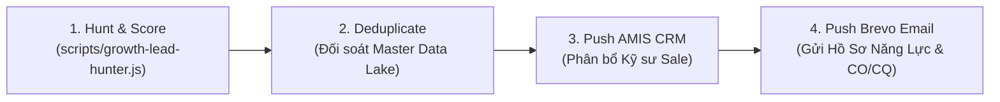

# B2B Lead Growth Engine & Hunter (SKILL)
*Hệ thống Chuyên gia AI Tìm Kiếm, Làm Giàu & Chấm Điểm Khách Hàng Doanh Nghiệp (thanhoattinh.net)*

---

## 1. Xây Dựng Chân Dung Khách Hàng Lý Tưởng (ICP Construction)

Một hồ sơ ICP chuẩn B2B cho ngành **Than Hoạt Tính & Vật Liệu Lọc Môi Trường Xuyên Việt** phải trả lời trọn vẹn 7 câu hỏi:

1. **Ngành nghề trọng tâm (Verticals)**:
   - *Ngành 1*: Sản xuất Bột giấy, Giấy bao bì carton (Tiêu thụ Than hoạt tính khử màu, Polymer, PAC).
   - *Ngành 2*: Dệt may & Nhuộm hoàn tất (Xử lý nước thải dệt nhuộm nồng độ COD cao).
   - *Ngành 3*: Xi mạ kim loại, Luyện kim, Cơ khí chính xác (Xử lý Cr, Ni, kim loại nặng).
   - *Ngành 4*: Chế biến Thực phẩm, Bia, Nước giải khát, Dược phẩm (Bảo vệ màng RO, khử Clo dư).
   - *Ngành 5*: Xưởng sơn, Gỗ, Keo dán, Hóa chất (Tháp hấp phụ VOCs Than Tổ Ong Honeycomb & Than Viên Trụ).
   - *Ngành 6*: Đơn vị Tổng thầu EPC, Nhà thầu M&E, Đại lý phân phối vật liệu lọc tỉnh.
2. **Quy mô doanh nghiệp (Company Size Categories)**:
   - **Enterprise (> 500 nhân sự / Doanh thu > 200 tỷ)**: Chu kỳ bán 1-3 tháng, ngân sách > 500tr/năm (Vinamilk, Wilmar, Tân Long...).
   - **SMB (50 - 500 nhân sự)**: Chu kỳ bán 2-4 tuần, ngân sách 50tr - 200tr/năm.
   - **Xưởng nhỏ (< 50 nhân sự)**: Chu kỳ bán 1-7 ngày, mua theo từng đợt thay thế lẻ.
3. **Địa bàn trọng điểm (Geography)**:
   - *Miền Nam*: Bình Dương (VSIP 1-2, Sóng Thần, Nam Tân Uyên), Đồng Nai (Amata, Nhơn Trạch), Long An (Đức Hòa, Cần Giuộc), TP.HCM.
   - *Miền Bắc*: Hà Nội, Hưng Yên (Phố Nối A), Bắc Ninh (Yên Phong, Quế Võ), Hải Phòng.
4. **Người ra quyết định (Decision-Makers)**:
   - Trưởng phòng Kỹ thuật Môi trường / Trưởng ban Quản lý Trạm Xử lý Nước thải (WWTP).
   - Trưởng phòng Mua hàng / Giám đốc Vật tư (Procurement Manager).
   - Giám đốc Nhà máy / Tổng Giám đốc (CEO/Plant Director).
5. **Tín hiệu nhu cầu cao (Intent & Growth Signals)**:
   - Nhà máy mở rộng công suất hoặc xây dựng cụm xử lý nước thải mới.
   - Doanh nghiệp đăng tin tuyển dụng "Kỹ sư vận hành xử lý nước thải", "Nhân viên QC/Lab".
   - Đến hạn kiểm tra định kỳ QCVN 40:2011/BTNMT hoặc gia hạn Giấy phép môi trường (GPMT).
6. **Điểm đau cốt lõi (Pain Points)**:
   - Bị rò rỉ than mịn gây tắc nghẽn màng RO $\rightarrow$ Cần Than Ấn Độ có độ cứng $\ge 98\%$.
   - Nước thải sau lọc vẫn còn độ màu khó xử lý $\rightarrow$ Cần Than gáo dừa Iodine cao kết hợp PAC.
   - Tháp khử mùi sơn bị sụt áp cao, quạt hút bị quá tải $\rightarrow$ Cần Than Khối Tổ Ong kháng nước.

---

## 2. Kỹ Thuật Tìm Kiếm & Cào Dữ Liệu Web (Search Query Patterns)

### Mẫu câu truy vấn tìm kiếm doanh nghiệp mục tiêu:
```
# Tìm kiếm nhà máy theo ngành và KCN
"nhà máy sản xuất bao bì giấy" "Bình Dương" site:masothue.com OR site:hosocongty.vn
"trạm xử lý nước thải" "KCN Sóng Thần" OR "KCN Nhơn Trạch"
"công ty dệt nhuộm" "nước thải" "Long An"

# Tìm kiếm tín hiệu tuyển dụng (High Intent)
"tuyển dụng" "kỹ sư vận hành trạm xử lý nước thải" "Bình Dương"
"tuyển" "nhân viên môi trường" "khu công nghiệp"

# Tìm kiếm người ra quyết định
"Trưởng phòng Mua hàng" OR "Trưởng phòng Môi trường" "[Tên Công Ty]" site:linkedin.com
```

---

## 3. Hệ Thống Chấm Điểm Lead Scoring (Fit + Intent Scoring)

Mỗi Lead được chấm theo thang điểm 100 dựa trên 2 trục:

$$\text{Tổng Điểm (Lead Score)} = \text{Fit Score (0 – 50)} + \text{Intent Score (0 – 50)}$$

### A. Fit Score (Mức độ phù hợp — Tối đa 50 điểm):
* **Ngành nghề trọng tâm**: Giấy/bao bì, dệt nhuộm, xi mạ, thực phẩm (+25đ).
* **Vị trí KCN trọng điểm**: Bình Dương, Đồng Nai, Long An, TP.HCM (+15đ).
* **Độ đầy đủ thông tin**: Có cả SĐT và Email (+10đ).

### B. Intent Score (Tín hiệu nhu cầu — Tối đa 50 điểm):
* **Tín hiệu mở rộng / xây dựng hệ thống mới**: (+20đ).
* **Tín hiệu tuyển dụng kỹ sư môi trường / vận hành**: (+15đ).
* **Nhu cầu cụ thể về than, hóa chất, khử clo/mùi**: (+15đ).

### C. Phân Loại Hạng Lead (Lead Grading):
* 🚀 **Hạng A (Hot Leads - 80 đến 100 điểm)**: Chuyển ngay cho Kỹ sư Sale gọi điện trong **15 phút**.
* 🟡 **Hạng B (Warm Leads - 60 đến 79 điểm)**: Nạp vào Brevo List 2 để chạy chuỗi Email Chăm Sóc & Hồ Sơ CO/CQ.
* ⚪ **Hạng C (Cold Leads - < 60 điểm)**: Lưu vào Data Lake để tiếp tục làm giàu dữ liệu.

---

## 4. Hướng Dẫn Thực Thi CLI (`scripts/growth-lead-hunter.js`)

```bash
# 1. Quét tìm kiếm lead nhà máy theo ngành và địa bàn
node scripts/growth-lead-hunter.js --industry="Bao Bì Giấy, Dệt Nhuộm" --province="Bình Dương" --limit=20

# 2. Quét tìm kiếm xưởng sơn & xử lý khí thải tại Long An
node scripts/growth-lead-hunter.js --industry="Xưởng Sơn, Gỗ, Khí Thải VOCs" --province="Long An" --limit=15

# 3. Xem báo cáo phân tích chất lượng Lead vừa cào
# File xuất tự động tại: plans/marketing/reports/lead-hunter-report.md
```

---

## 5. Quy Trình 4 Bước Đưa Lead Vào Phễu Doanh Thu (Closed-Loop Workflow)


