# KẾ HOẠCH TỔNG THỂ XÂY DỰNG LANDING PAGE CHUYỂN ĐỔI CAO (TRANG ANH AI)
## MASTER BLUEPRINT & CONTENT ARCHITECTURE (B2B EXECUTIVE LANDING PAGE)
### ĐỊNH VỊ CHIẾN LƯỢC: ĐỒNG HÀNH KIẾN TRÚC & CHUYỂN GIAO TỰ CHỦ (CO-ARCHITECTURE & AUTONOMOUS TRANSFER)

```text
======================================================================================================
  LANDING PAGE MASTER PLAN: TRANG ANH AI — TRANG BỊ QUY TRÌNH. TINH ANH VẬN HÀNH.
  CHUYÊN TRANG CHUYỂN ĐỔI DÀNH RIÊNG CHO CEO, CHỦ DOANH NGHIỆP & NHÀ QUẢN TRỊ MARKETING B2B
  NGÔN NGỮ QUẢN TRỊ THỰC TIỄN — KHÔNG THUẬT NGỮ CÔNG NGHỆ ĐÁNH ĐỐ — MINH BẠCH GIÁ TRỊ KINH DOANH
======================================================================================================
```

> **Hub Ngữ Cảnh Nguồn (SSOT):** [`plans/marketing-context.md`](file:///E:/Projects/done-with-you/plans/marketing-context.md)  
> **Bộ Nhận Diện Thương Hiệu:** **TRANG ANH AI** (*"Trang bị quy trình. Tinh anh vận hành."* — *Elite Systems. Easy Growth.*)  
> **Đối tượng độc giả trọng tâm:** **Chủ Doanh Nghiệp (CEO/Founder), Lãnh đạo kế nghiệp (F2), Giám đốc Marketing (CMO/Marketing Manager), Giám đốc Kinh doanh (CCO/Sales Director)** trong các ngành B2B Kỹ thuật, Vật tư, Công nghiệp, Phân phối và Sản xuất.  
> **Mục tiêu chuyển đổi cốt lõi:** Đăng ký nhận **"Khám Sức Khỏe Vận Hành (AI Readiness Audit)"** và đặt lịch **"Trải Nghiệm Live Demo 45 Phút Trên Dữ Liệu Thật Của Doanh Nghiệp"**, chốt gói chào hàng **"The Ultimate 0-Setup Offer"** (Retainer 6 tháng thu trước Quý 1).

---

## 🧭 1. ĐỊNH HƯỚNG CHIẾN LƯỢC & NGUYÊN TẮC VIỆT HÓA THUẬT NGỮ

Để thông điệp chạm đúng vào tâm lý ra quyết định của các nhà quản trị (vốn quan tâm đến **Chi phí, Doanh thu, Nhân sự và Sự kiểm soát** thay vì thuật ngữ kỹ thuật), toàn bộ nội dung landing page tuân thủ bảng chuyển ngữ sau:

| Thuật Ngữ Kỹ Thuật Nội Bộ | Ngôn Ngữ Quản Trị Dành Cho CEO & Marketer | Lợi Ích Thực Tế Mang Lại Cho Doanh Nghiệp |
|---|---|---|
| **Master RAG Lake** | **Bộ Não Tri Thức Số Doanh Nghiệp (Không Ảo Giác)** | Gom toàn bộ catalogue, bảng giá Excel, tiêu chuẩn kỹ thuật về một nơi; nhân viên cũ nghỉ việc không lo mất bí kíp. |
| **Generative Engine Optimization (GEO)** | **Cỗ Máy Xuất Hiện Tự Động Trên Các Công Cụ Chat AI** | Đưa thương hiệu và sản phẩm xuất hiện trực tiếp trong câu trả lời của ChatGPT, Perplexity, Gemini khi khách hàng B2B tìm kiếm. |
| **Deterministic SQL Engine** | **Động Cơ Tính Giá Chuẩn Xác 100% (Cấm AI Đoán Mò)** | Đảm bảo mọi phép tính chiết khấu, giá sỉ/lẻ chuẩn xác đến từng đồng, tuyệt đối không để AI tính nhẩm sai lệch. |
| **Workflow Alignment** | **Căn Chỉnh Luồng Vận Hành Liền Mạch Từ Web Đến Chốt Đơn** | Khách tìm thấy trên AI Search $\rightarrow$ Chatbot tư vấn 24/7 $\rightarrow$ Soạn dự toán/báo giá gửi nhân viên duyệt $\rightarrow$ Cập nhật báo cáo CEO. |
| **Executive BI Dashboard (M0)** | **Báo Cáo Quản Trị 1 Trang Tức Thì Cho Ban Lãnh Đạo** | CEO nhìn thấy tức thì số lượng khách tiếp cận, tỷ lệ chuyển đổi và doanh số từng kênh mà không cần chờ nhân viên làm báo cáo. |
| **Co-architecture & Transfer (DWY)** | **Đồng Hành Xây Dựng & Chuyển Giao Tự Chủ Sau 4 Tuần** | Trang Anh AI gánh 90% kỹ thuật ban đầu, cài trên tài khoản chính chủ của khách, bàn giao quy trình để doanh nghiệp tự làm chủ vĩnh viễn. |

---

## 🎨 2. HỆ THỐNG MÀU SẮC & NHẬN DIỆN THƯƠNG HIỆU (SOFT NORDIC TECH)

Tuân thủ bộ nhận diện thương hiệu chuẩn mực tại [`plans/marketing-context.md`](file:///E:/Projects/done-with-you/plans/marketing-context.md) theo tỷ lệ thị giác vàng **60 - 30 - 10**:

* **Màu Nền Tảng (Base - 60%):** `Deep Slate Charcoal` (`#1E293B`) — Tiêu đề chính, khung nền tối lịch thiệp, mang lại cảm giác vững chãi, uy tín và chuyên nghiệp.
* **Màu Thương Hiệu (Brand - 30%):** `Brand AI Blue` (`#4F46E5`) — Thể hiện trí tuệ, hiện đại, sử dụng cho các biểu tượng chức năng và đường kết nối luồng.
* **Màu Điểm Nhấn & Chuyển Đổi (Accent/CTA - 10%):** `Sage Teal` (`#0D9488`) — Tạo sự an tâm, tươi mới, dùng cho toàn bộ nút kêu gọi hành động (CTA) và số liệu tăng trưởng.
* **Màu Cảnh Báo & Điểm Nhấn Phụ:** `Warm Amber` (`#F59E0B`) — Nhấn mạnh các cảnh báo rủi ro pháp lý và huy hiệu ưu đãi.
* **Nền Phụ & Card Sáng:** `Soft Mist White` (`#F8FAFC` / `#FFFFFF`) — Nền các khối nội dung, tạo cảm giác thoáng đãng, dễ đọc.

---

## 🏛️ 3. CẤU TRÚC 9 KHỐI NỘI DUNG CHUYỂN ĐỔI CAO (9-SECTION BLUEPRINT)

```mermaid
graph TD
    S1["<b>SECTION 1: HERO (Above the Fold)</b><br/>• Tiêu đề: Xóa bỏ điểm nghẽn vận hành & Tự chủ cỗ máy AI Doanh nghiệp<br/>• Visual: Bảng điều khiển vận hành 3 tầng (Tri thức - Tác nghiệp - Báo cáo CEO)<br/>• CTA: Đăng ký Khám Sức Khỏe Vận Hành & Live Demo 45 phút"]
    
    S2["<b>SECTION 2: THỰC TRẠNG THỊ TRƯỜNG & 4 BẤT CẬP AI HIỆN TẠI</b><br/>• 48.8% DN dừng CĐS (Bộ KH&ĐT), 41% khó chứng minh ROI<br/>• 4 Rủi ro: AI tự bịa thông số, tàng hình trên AI Search, rò rỉ dữ liệu, nhân viên không dùng"]
    
    S3["<b>SECTION 3: 3 ĐIỂM NGHẼN VẬN HÀNH B2B VIỆT NAM</b><br/>• 1. Tri thức nằm trong đầu cá nhân • 2. Mất đơn vì báo giá chậm • 3. CEO mù mờ số liệu"]
    
    S4["<b>SECTION 4: BỘ BA TRỤ CỘT CỐT LÕI (HỆ ĐIỀU HÀNH AI TRANG ANH)</b><br/>• 1. Bộ Não Tri Thức Số & Hiện Diện AI Search (GEO) • 2. Luồng Tác Nghiệp Tự Động • 3. Báo Cáo Quản Trị 1 Trang"]
    
    S5["<b>SECTION 5: ỨNG DỤNG THỰC TẾ THEO NGÀNH B2B (INDUSTRY USE CASES)</b><br/>• Tab 1: Hóa chất & Môi trường | Tab 2: Van & Cơ điện M&E | Tab 3: Doanh nghiệp Đa Website"]
    
    S6["<b>SECTION 6: LỘ TRÌNH 4 TUẦN ĐỒNG HÀNH & CHUYỂN GIAO TỰ CHỦ</b><br/>• Tuần 1: Chuẩn hóa dữ liệu -> Tuần 2: Cài đặt chính chủ -> Tuần 3: Căn chỉnh luồng -> Tuần 4: Đào tạo & Bàn giao"]
    
    S7["<b>SECTION 7: BẢNG GIÁ 3 GÓI RETAINER & THE ULTIMATE 0-SETUP OFFER</b><br/>• Gói 1: Nền tảng (12.5tr) | Gói 2: Tăng trưởng (24tr - Hero) | Gói 3: Toàn diện (41.5tr)<br/>• Tặng 100% phí kiến trúc ban đầu khi ký 6 tháng thu trước Quý 1"]
    
    S8["<b>SECTION 8: MINH BẠCH PHÁP LÝ & GIẢI ĐÁP THẮC MẮC (FAQ)</b><br/>• Luật Dữ Liệu 91/2025, Luật AI 134/2025, Cam kết QBR ngày 75, Tài khoản Enterprise riêng"]
    
    S9["<b>SECTION 9: ĐĂNG KÝ AUDIT & TRẢI NGHIỆM LIVE DEMO (FINAL CTA)</b><br/>• Form 4 trường tinh gọn, cam kết bảo mật thông tin, kết nối chuyên gia trong 2 giờ"]

    S1 --> S2 --> S3 --> S4 --> S5 --> S6 --> S7 --> S8 --> S9
```



---

## 📝 4. CHI TIẾT KỊCH BẢN NỘI DUNG TỪNG SECTION (COPYWRITING SCRIPTS)

### SECTION 1: HERO SECTION (ĐỈNH CAO ĐỊNH VỊ QUẢN TRỊ)

* **Huy hiệu đầu trang (Eyebrow Badge):**  
  `🛡️ ĐỐI TÁC ĐỒNG HÀNH KIẾN TRÚC & CHUYỂN GIAO HỆ THỐNG AI AGENT VẬN HÀNH B2B`
* **Tiêu đề chính (Headline H1):**  
  # Xóa Bỏ Điểm Nghẽn Vận Hành.  
  # Xây Dựng Cỗ Máy Doanh Nghiệp Tự Chủ Bằng AI Agent Trên Hạ Tầng Chính Chủ.
* **Tiêu đề phụ (Subheadline H2):**  
  > *Không bán công cụ rời rạc, không làm hộ rỗng ruột. Trang Anh AI đồng hành số hóa toàn bộ tài sản tri thức doanh nghiệp, tự động hóa hiện diện trên các công cụ Chat AI (ChatGPT, Gemini), căn chỉnh luồng tác nghiệp từ Tiếp thị đến Bán hàng, và trang bị Báo Cáo Quản Trị 1 Trang để Ban Lãnh Đạo làm chủ cỗ máy chỉ sau 4 tuần.*
* **Nút kêu gọi hành động chính (Primary CTA - Màu Sage Teal `#0D9488`):**  
  `[ ĐĂNG KÝ KHÁM SỨC KHỎE VẬN HÀNH & LIVE DEMO TRÊN DỮ LIỆU THẬT ]`
* **Cam kết an toàn & bảo mật (Trust Markers):**  
  *🔒 Cài đặt 100% trên tài khoản Enterprise chính chủ • Tuân thủ Luật Dữ Liệu 91/2025/QH15 & Luật AI 134/2025/QH15 • Sở hữu vĩnh viễn quy trình & dữ liệu sạch.*
* **Hình ảnh tương tác trực quan (Hero Visual Mockup):**  
  Minh họa **Bảng Điều Khiển Vận Hành Đa Tầng (Executive Operations Command Center)** hiển thị sống động 3 kết quả cụ thể:
  1. *Khối Dữ Liệu:* Kho tri thức đã chuẩn hóa (bảng giá, hồ sơ năng lực, catalogue kỹ thuật).
  2. *Khối Tác Nghiệp:* Khách hỏi trên AI Search $\rightarrow$ LiveChat 24/7 tiếp nhận $\rightarrow$ Trợ lý kỹ thuật soạn dự toán và báo giá chuẩn xác gửi nhân viên duyệt.
  3. *Khối Quản Trị:* Báo cáo 1 trang thời gian thực hiển thị doanh số, số khách mới và năng suất tiết kiệm được cho Ban Giám Đốc.

---

### SECTION 2: THỰC TRẠNG THỊ TRƯỜNG & 4 BẤT CẬP KHI DÙNG AI TỰ PHÁT

* **Tiêu đề khối (H2):**  
  ## Tại Sao 48,8% Doanh Nghiệp Từng Ứng Dụng Công Nghệ Buộc Phải Dừng Lại?  
  *(Nguồn số liệu: Báo cáo Thường niên Chuyển Đổi Số — Bộ Kế Hoạch & Đầu Tư phối hợp cùng Tổ chức GIZ)*
* **Thông điệp dẫn dắt:** Doanh nghiệp B2B không thiếu công cụ AI (ChatGPT, Copilot, Canva...). Thứ doanh nghiệp đang thiếu là **một nền tảng dữ liệu chuẩn xác** và **một quy trình vận hành gắn kết**. 
* **Bảng so sánh 4 Bất Cập của AI Truyền Thống vs. Giải Pháp Trang Anh AI:**

| Bất Cập Khiến Doanh Nghiệp Thất Vọng Với AI Tự Phát | Chuẩn Mực Giải Pháp Của TRANG ANH AI |
|---|---|
| **1. AI tự bịa thông số & tính nhẩm sai:** LLM tự đoán mã hàng kỹ thuật, tính toán sai đơn giá chiết khấu, gây rủi ro thất thoát hoặc đền hợp đồng. | **Dữ Liệu Chuẩn Xác 100% (Cấm AI Tính Nhẩm):** Toàn bộ phép tính giá và tra cứu thông số được khóa chặt vào cơ sở dữ liệu gốc của công ty. Chính xác tuyệt đối từng đồng. |
| **2. Tàng hình trên các công cụ Chat AI mới:** Khách hàng B2B ngày nay hỏi ChatGPT, Perplexity để tìm nhà cung ứng, nhưng website của bạn không hề được AI nhắc đến. | **Cỗ Máy Hiện Diện AI Search Tự Động:** Sản xuất các bài viết chuyên gia sâu sắc từ chính dữ liệu của công ty, tối ưu cấu trúc để các công cụ Chat AI trích dẫn thương hiệu của bạn. |
| **3. Rò rỉ dữ liệu & Nguy cơ pháp lý:** Nhân viên copy bảng giá mật, thông tin khách hàng dán lên các công cụ AI công cộng, đối mặt án phạt theo Luật Dữ Liệu 91/2025. | **Hạ Tầng Enterprise Độc Lập:** Cài đặt trực tiếp trên không gian làm việc chính chủ của doanh nghiệp. Dữ liệu không bao giờ bị lộ ra ngoài hay bị dùng để huấn luyện AI chung. |
| **4. Bội thực công cụ, nhân viên không dùng:** Mua nhiều phần mềm đắt tiền nhưng nhân viên vẫn quay về nhắn Zalo, gõ Excel thủ công vì công cụ quá phức tạp. | **Nhúng Nhẹ Nhàng Vào Quy Trình Có Sẵn:** AI chuẩn bị sẵn 95% công việc (soạn bài, tra giá, làm dự toán), nhân viên chỉ cần **10 giây kiểm tra và bấm duyệt**. |

---

### SECTION 3: 3 ĐIỂM NGHẼN VẬN HÀNH B2B VIỆT NAM (PAIN POINTS)

* **Tiêu đề khối (H2):**  
  ## Ba "Lỗ Rò Rỉ Vận Hành" Đang Âm Thầm Bào Mòn Biên Lợi Nhuận Của Doanh Nghiệp
* **Chi tiết 3 điểm nghẽn thực tế:**
  1. **Điểm nghẽn 1: Tri thức doanh nghiệp bị "bắt cóc" bởi cá nhân:**  
     Bảng giá lưu trong máy cá nhân, quy trình kỹ thuật nằm trong đầu người cũ, catalogue rải rác khắp các nhóm chat. Khi một nhân sự kỳ cựu nghỉ việc, doanh nghiệp mất từ 3–6 tháng và hàng chục triệu đồng để tuyển và đào tạo người mới.
  2. **Điểm nghẽn 2: Mất khách hàng vào tay đối thủ vì phản hồi chậm trễ:**  
     Khách hỏi bảng giá dự toán hoặc thông số thử nghiệm, nhân viên mất hàng giờ lục tìm file cũ. 68% người mua B2B chọn đơn vị phản hồi chuyên nghiệp đầu tiên; sự chậm trễ đồng nghĩa với việc nhường doanh thu cho đối thủ.
  3. **Điểm nghẽn 3: Ban Giám Đốc điều hành bằng cảm tính vì thiếu số liệu:**  
     CEO và Giám đốc Marketing muốn biết hiệu quả các kênh, số lượng khách hỏi và tình hình chốt đơn phải chờ đợi báo cáo tổng hợp thủ công cuối tháng. Thiếu bức tranh số liệu tức thì khiến việc ra quyết định kinh doanh luôn bị trễ nhịp.

---

### SECTION 4: DÂY CHUYỀN 5 NODE VẬN HÀNH B2B KHÉP KÍN (THE 5-NODE INTERACTIVE PIPELINE)

* **Tiêu đề khối (H2):**  
  ## Dây Chuyền Vận Hành 5 Node Khép Kín: Từ Tri Thức Gốc Đến Doanh Thu Thực Tế
* **Mô hình trực quan hóa quan hệ giữa 5 Node (Interactive Flowchart):**  
  Giao diện thể hiện một sơ đồ dòng chảy dữ liệu trực quan kết nối sống động 5 Node, cho phép người dùng click vào từng Node để xem chi tiết dữ liệu vào (Input), bộ máy xử lý (Engine) và kết quả bàn giao (Output):

```text
+-----------------------------------------------------------------------------------------------------------------------+
|                              SƠ ĐỒ 5 NODE VẬN HÀNH LIỀN MẠCH — TRANG ANH OPERATIONS ENGINE                            |
+-----------------------------------------------------------------------------------------------------------------------+
| [NODE 1: RAG DATA HUB]       ==> [NODE 2: FLOW CONTENT & GEO]  ==> [NODE 3: TIẾP ĐÓN 24/7 & CRM]                      |
| • Số hóa Excel gộp ô             • Xuất bản 16-24 bài E-E-A-T      • Chatbot AI tư vấn kỹ thuật 24/7                  |
| • TDS, Catalogue, Tiêu chuẩn     • Phủ sóng ChatGPT / Gemini       • Thu thập SĐT/Zalo, gắn tag Lead                  |
| • Khử sạch ảo giác (SQL)         • Chăm sóc 1-3+ Web vệ tinh       • Tự động đồng bộ Deal vào CRM                     |
|            ||                                                                    ||                                   |
|            \/                                                                    \/                                   |
|            ========================> [NODE 4: SALES & BÁO GIÁ NHANH] <============                                    |
|                                      • Trợ lý lập dự toán BOQ vật tư 2 phút                                           |
|                                      • Xuất file báo giá PDF Vector + VietQR                                          |
|                                      • Nhân viên kiểm tra 10s bấm gửi khách                                           |
|                                                         ||                                                            |
|                                                         \/                                                            |
|                                      [NODE 5: EXECUTIVE BI DASHBOARD]                                                 |
|                                      • Màn hình điều hành 1 trang thời gian thực cho CEO                              |
|                                      • Nắm bắt: Khách AI Search -> Lead CRM -> Báo giá -> Doanh thu                   |
|                                      • Tối ưu ngược lại chính sách giá & danh mục Node 1                              |
+-----------------------------------------------------------------------------------------------------------------------+
```

* **Chi tiết 5 Node Vận Hành:**
  1. **Node 1 — RAG Data Hub (Gốc rễ tri thức):** Nền tảng sống của toàn bộ hệ thống. Gom sạch bảng giá, catalogue, tiêu chuẩn kỹ thuật (ASTM, QCVN, Quatest) vào một nơi, khử sạch hoàn toàn lỗi tính nhẩm của AI.
  2. **Node 2 — Flow Content & Hiện diện AI Search (Kênh thu hút):** Lấy nhiên liệu từ Node 1 để tự động sản xuất bài viết chuyên gia và đưa thương hiệu xuất hiện khi người mua B2B tìm kiếm trên Google và ChatGPT/Gemini.
  3. **Node 3 — Tiếp đón 24/7 & Tự động hóa CRM (Bộ lọc & Lưu trữ):** Giữ chân khách truy cập bất kể ngày đêm, tư vấn kỹ thuật chuẩn xác và tự động bắn dữ liệu khách vào CRM (MISA AMIS, Brevo, Google Sheets), không bao giờ để rơi rụng cơ hội.
  4. **Node 4 — Sales Enablement & Báo giá nhanh (Cỗ máy chốt đơn):** Đội ngũ Sales nhận Lead kèm lịch sử tư vấn. Trợ lý kỹ thuật hỗ trợ lập dự toán BOQ trong 2 phút và xuất báo giá PDF kèm VietQR tức thì, giúp sales chốt deal nhanh gấp 10 lần đối thủ.
  5. **Node 5 — Executive BI Dashboard (Ban Lãnh Đạo kiểm soát):** Màn hình đo lường dòng chảy doanh thu thực tế, giúp CEO và Marketing Manager ra quyết định dựa trên dữ liệu thật.

---

### SECTION 5: ỨNG DỤNG THỰC TẾ THEO NGÀNH B2B (INDUSTRY USE CASES TABS)

* **Tiêu đề khối (H2):**  
  ## Giải Pháp Được May Đo Chuẩn Xác Cho Từng Ngành Kỹ Thuật & Công Nghiệp
* **3 Tab nội dung thực tế:**

#### TAB 1: Ngành Hóa Chất, Vật Liệu Lọc & Xử Lý Nước
* **Thu hút khách hàng mới:** Khách hàng hỏi ChatGPT *"So sánh than hoạt tính gáo dừa và than đá trong xử lý nước cấp?"* $\rightarrow$ AI trích dẫn bài phân tích kỹ thuật trên website của bạn làm câu trả lời chuẩn.
* **Hỗ trợ bán hàng:** Khách gửi tin nhắn hỏi nhanh hoặc ảnh chụp tem bao bì $\rightarrow$ Trợ lý đối chiếu tức thì với hồ sơ Quatest, chỉ số Iodine, tự động tính toán thể tích bồn lọc và xuất bảng giá kèm mã thanh toán trong vài giây.
* **Quản trị:** CEO theo dõi được nhu cầu tìm kiếm của các nhà máy công nghiệp theo từng khu vực.

#### TAB 2: Ngành Van, Thiết Bị Công Nghiệp & Cơ Điện (M&E)
* **Thu hút khách hàng mới:** Xuất hiện đầu tiên trên các công cụ tìm kiếm khi kỹ sư tra cứu tiêu chuẩn mặt bích DIN, van điều khiển khí nén hoặc thông số chịu áp lực PN16.
* **Hỗ trợ bán hàng:** Tiếp nhận danh mục yêu cầu dự án gồm hàng chục mã vật tư $\rightarrow$ Tự động bóc tách quy cách, kiểm tra tồn kho và lập **Bảng dự toán chi phí (BOQ)** hoàn chỉnh cho phòng kỹ thuật.
* **Quản trị:** Nắm bắt tỷ lệ chuyển đổi từ giai đoạn gửi báo giá dự thầu đến khi ký hợp đồng.

#### TAB 3: Doanh Nghiệp Vận Hành Nhiều Website Vệ Tinh (1–3+ Sites)
* **Bài toán:** Muốn mở rộng độ phủ thị trường bằng 2–3 website vệ tinh nhưng không đủ nhân sự viết bài, lo sợ bị phạt vì nội dung trùng lặp.
* **Giải pháp Trang Anh AI:** **Mô hình Một Trung Tâm — Đa Chi Nhánh** — Toàn bộ tri thức nằm tại một bộ não tập trung, hệ thống tự động biên tập và phân luồng nội dung độc bản cho từng website theo từng tệp khách hàng riêng biệt. Tiết kiệm 80% chi phí duy trì đội ngũ nội dung.

---

### SECTION 6: LỘ TRÌNH 4 TUẦN ĐỒNG HÀNH & CHUYỂN GIAO TỰ CHỦ (DONE-WITH-YOU)

* **Tiêu đề khối (H2):**  
  ## Lộ Trình 4 Tuần Đồng Hành: Trang Anh AI Gánh 90% Khối Lượng Kỹ Thuật Ban Đầu
* **Nội dung 4 cột mốc tuần:**
  * **Tuần 1 — Khảo Sát & Chuẩn Hóa Dữ Liệu:**  
    *Trang Anh AI thực hiện:* Tiếp nhận bảng giá Excel, catalogue, tài liệu kỹ thuật; xử lý gỡ gộp ô phức tạp, số hóa dữ liệu thành bộ não tri thức sạch.  
    *Doanh nghiệp cần làm:* Bàn giao tài liệu hiện có và cử 1 đầu mối đối soát thông tin.
  * **Tuần 2 — Cài Đặt Hệ Thống Trên Tài Khoản Chính Chủ:**  
    *Trang Anh AI thực hiện:* Thiết lập cỗ máy trên không gian làm việc Enterprise riêng biệt của khách hàng; cài đặt giọng văn thương hiệu, thiết lập luồng xuất bản bài viết và Chatbot 24/7.
  * **Tuần 3 — Căn Chỉnh Luồng Vận Hành Thực Tế:**  
    *Trang Anh AI thực hiện:* Kiểm thử thực tế các tình huống hỏi đáp kỹ thuật, lập bảng dự toán và báo giá; kết nối dữ liệu về màn hình Báo Cáo Quản Trị 1 Trang cho lãnh đạo.
  * **Tuần 4 — Đào Tạo Nhân Sự & Bàn Giao Quy Trình (SOP):**  
    *Trang Anh AI thực hiện:* Tổ chức 2 buổi đào tạo thực chiến cho nhân viên tác nghiệp (cách kiểm tra và duyệt việc trong 10 giây) và Ban Giám Đốc (cách khai thác số liệu báo cáo).  
    *Bàn giao:* Doanh nghiệp chính thức làm chủ 100% hệ thống, ký nghiệm thu chuyển tiếp sang giai đoạn duy trì Retainer.

---

### SECTION 7: BẢNG GIÁ ĐẦU TƯ MINH BẠCH & "THE ULTIMATE 0-SETUP OFFER"

* **Tiêu đề khối (H2):**  
  ## Chi Phí Đầu Tư Minh Bạch — Đem Lại Giá Trị Vận Hành Vượt Trội
* **Huy hiệu Ưu đãi Đột phá:**  
  > 🎁 **THE ULTIMATE 0-SETUP OFFER:** **TẶNG MIỄN PHÍ 100% PHÍ KIẾN TRÚC & CHUYỂN GIAO BAN ĐẦU (TIẾT KIỆM TỚI 35.000.000 Đ)** khi ký Hợp đồng Retainer 06 tháng thu trước theo Quý. Áp dụng giới hạn cho **20 Doanh nghiệp Tiên phong**.

* **Bảng Giá 3 Gói Retainer Chuẩn:**

| Hạng Mục Quyền Lợi & Tính Năng | GÓI 1: NỀN TẢNG (Foundation) | GÓI 2: TĂNG TRƯỞNG (Growth) ⭐ *(Gói Chủ Lực)* | GÓI 3: TOÀN DIỆN (Enterprise) |
|---|---|---|---|
| **Mức Phí Đầu Tư Vận Hành / Tháng** | **12.500.000 VNĐ** | **24.000.000 VNĐ** | **41.500.000 VNĐ** |
| **Phí Kiến Trúc Ban Đầu & SOP** | ~~20.000.000 đ~~ $\rightarrow$ **MIỄN PHÍ** | ~~25.000.000 đ~~ $\rightarrow$ **MIỄN PHÍ** | ~~35.000.000 đ~~ $\rightarrow$ **MIỄN PHÍ** |
| **Kỳ hạn HĐ & Thanh toán Quý 1** | **37.500.000 VNĐ** *(03 tháng)* | **72.000.000 VNĐ** *(03 tháng)* | **124.500.000 VNĐ** *(03 tháng)* |
| **Quy mô Website Vận Hành** | 01 Website chính | **1 – 3 Website vệ tinh tập trung** | 3 – 5+ Website vệ tinh |
| **Hiện Diện Trên Chat AI & Bài Viết** | 8 – 12 bài chuyên sâu / tháng | **16 – 24 bài chuyên sâu đa site** | 30+ bài + Tài liệu kỹ thuật chuyên biệt |
| **Bộ Não Tri Thức Số Doanh Nghiệp** | Cập nhật định kỳ hàng tháng | **Cập nhật Real-time + Đa kênh** | Master Lake toàn diện + Tra cứu đa tầng |
| **AI Tư Vấn Khách Hàng 24/7** | LiveChat Web cơ bản | **LiveChat Web + Fanpage + Zalo OA** | Hệ thống CSKH Đa kênh hoàn chỉnh |
| **Trợ Lý Dự Toán & Báo Giá** | — | **Có (Dự toán BOQ & Báo giá chuẩn)** | Dự toán BOQ nâng cao + Hồ sơ thầu |
| **Báo Cáo Quản Trị 1 Trang (CEO)** | Báo cáo tóm tắt hàng tháng | **Dashboard 1 Trang Real-time** | Dashboard Quản trị + Mô phỏng kịch bản |
| **Bảo Đảm Hoàn Tiền Ngày 75 (QBR)** | Có | **Cam kết hoàn tiền 100%** | Cam kết hoàn tiền 100% |
| **Quy đổi giá trị nhân sự tương đương** | ~1 Nhân viên Content (13.5tr/tháng) | ~1 Sales Admin + 1 Content + 1 SEO (~35tr/tháng) | Cả phòng Kỹ thuật + Marketing + Thầu (~70tr/tháng) |

---

### SECTION 8: MINH BẠCH PHÁP LÝ & GIẢI ĐÁP BĂN KHOĂN (FAQ)

* **Tiêu đề khối (H2):**  
  ## Minh Bạch Pháp Lý & Giải Đáp Băn Khoăn Của Nhà Quản Trị
* **4 Câu hỏi giải tỏa rào cản tâm lý:**
  1. *Dữ liệu nội bộ và bí mật kinh doanh của công ty tôi có bị rò rỉ hoặc bị chia sẻ cho bên ngoài không?*  
     $\rightarrow$ **Tuyệt đối an toàn.** Hệ thống được thiết lập hoàn toàn trên tài khoản Enterprise chính chủ của doanh nghiệp bạn. Mọi dữ liệu khách hàng, bảng giá và công thức kỹ thuật đều được mã hóa và bảo vệ theo tiêu chuẩn của **Luật Dữ Liệu 91/2025/QH15**. Doanh nghiệp sở hữu vĩnh viễn toàn bộ dữ liệu và quy trình đã chuẩn hóa.
  2. *Nói là "Đồng hành kiến trúc" thì phía doanh nghiệp tôi có phải cử người làm nhiều việc kỹ thuật phức tạp không?*  
     $\rightarrow$ **Không.** Trang Anh AI trực tiếp thực hiện 90% khối lượng công việc nặng nhọc nhất trong 4 tuần đầu (làm sạch file, cài đặt hệ thống, kết nối luồng). Nhân sự của bạn chỉ cần cung cấp file mẫu và tham gia 2 buổi nhận bàn giao quy trình ở tuần thứ 4. Quy trình tác nghiệp hàng ngày được thiết kế sao cho nhân viên chỉ cần **10 giây để kiểm tra và bấm duyệt**.
  3. *Làm sao Ban Giám Đốc đo lường được hiệu quả thực tế (ROI) sau khi đưa hệ thống vào hoạt động?*  
     $\rightarrow$ Hiệu quả được chứng minh bằng các con số thực tế ngay trên Báo Cáo Quản Trị 1 Trang: (1) Số lượng khách hàng tiềm năng đến từ các công cụ tìm kiếm và Chat AI; (2) Số giờ công lao động được giải phóng cho đội ngũ bán hàng và kỹ thuật; (3) Tốc độ phản hồi báo giá rút ngắn từ nhiều giờ xuống còn vài giây.
  4. *Chính sách Cam Kết Đánh Giá Quý Ngày 75 (QBR) và Hoàn tiền được thực hiện thế nào?*  
     $\rightarrow$ Vào ngày thứ 75 của hợp đồng, hai bên tổ chức buổi họp đánh giá kết quả thực tế. Nếu hệ thống không giúp tiết kiệm tối thiểu 30 giờ công lao động mỗi tháng hoặc không đạt được các tiêu chuẩn vận hành đã thống nhất, Trang Anh AI cam kết **hoàn trả 100% chi phí dịch vụ của tháng tiếp theo**, và doanh nghiệp vẫn giữ lại toàn bộ cơ sở dữ liệu đã được làm sạch.

---

### SECTION 9: FORM ĐĂNG KÝ AUDIT & TRẢI NGHIỆM LIVE DEMO (FINAL CTA)

* **Tiêu đề khối (H2):**  
  ## Đăng Ký Khám Sức Khỏe Vận Hành & Trải Nghiệm Live Demo 45 Phút
* **Lời dẫn:**  
  > *Nhận báo cáo phân tích các điểm nghẽn dữ liệu thực tế tại doanh nghiệp của bạn và trực tiếp chứng kiến cỗ máy AI xử lý tài liệu, bóc tách thông số kỹ thuật ngay trên màn hình.*
* **Form Đăng ký 4 Trường Tinh Gọn:**
  1. *Họ và Tên Lãnh đạo / Người đại diện:* (Bắt buộc)
  2. *Số điện thoại / Zalo kết nối:* (Bắt buộc)
  3. *Tên Doanh nghiệp & Ngành nghề kinh doanh:* (Bắt buộc)
  4. *Quy mô hiện tại (Số lượng nhân sự / Số lượng website):* (Dropdown chọn nhanh)
* **Nút bấm CTA nổi bật (Màu Sage Teal `#0D9488`):**  
  `[ GỬI THÔNG TIN — NHẬN BÁO CÁO AUDIT & ĐẶT LỊCH LIVE DEMO ]`
* **Cam kết bảo mật dưới chân form:**  
  *🔒 Thông tin của bạn được cam kết bảo mật 100% theo tiêu chuẩn Luật 91/2025/QH15. Chuyên gia của Trang Anh AI sẽ liên hệ xác nhận lịch trong vòng 2 giờ làm việc.*

---

## 💻 5. THIẾT KẾ KỸ THUẬT & TRẢI NGHIỆM NGƯỜI DÙNG (TECH & UX SPECIFICATIONS)

* **Nền tảng công nghệ:** Next.js 14+ (App Router, Server Components) + Tailwind CSS + Lucide Icons + Framer Motion.
* **Tốc độ tải trang & Trải nghiệm (Core Web Vitals):** Điểm PageSpeed $\ge 95$ trên cả Desktop và Mobile; LCP $< 1.2\text{s}$, FID/INP $< 100\text{ms}$, CLS $< 0.05$.
* **Tối ưu hiển thị In-App:** Tương thích hoàn hảo khi người dùng mở link từ Zalo, Facebook Messenger hoặc LinkedIn (không bị lỗi layout hay vỡ form).
* **Tự động hóa luồng dữ liệu (Data Pipeline):** Dữ liệu từ form đăng ký được gửi qua API Route `/api/leads`, tự động bắn thông báo tức thì về Telegram Admin trong 3 giây và đồng bộ vào hệ thống CRM/Email Marketing.

---

## 📅 6. KẾ HOẠCH TRIỂN KHAI 4 SPRINT LẬP TRÌNH

| Sprint | Thời Gian | Mục Tiêu Triển Khai | Kết Quả Bàn Giao (Deliverable) |
|---|---|---|---|
| **Sprint 1** | 2 ngày | Khởi tạo dự án Next.js, cấu hình Brand Theme (Deep Slate `#1E293B`, AI Blue `#4F46E5`, Sage Teal `#0D9488`), Layout Header/Footer chuẩn mực. | Khung giao diện sạch & Brand Tokens chuẩn |
| **Sprint 2** | 3 ngày | Lập trình giao diện 9 Section: Hero tương tác, Bảng 4 bất cập, 3 Trụ cột vận hành, Tabs ngành B2B, Lộ trình 4 tuần, Bảng giá và FAQ. | Toàn bộ giao diện tương tác Desktop & Mobile |
| **Sprint 3** | 2 ngày | Lập trình Form thu thập Lead, cơ chế chống spam (Honeypot), API Route xử lý webhook gửi Telegram Admin và đồng bộ CRM. | Luồng tiếp nhận Lead vận hành trơn tru |
| **Sprint 4** | 2 ngày | Rà soát 25 tiêu chuẩn tối ưu chuyển đổi (CRO), kiểm thử hiển thị trên trình duyệt Zalo Mobile, kiểm tra Core Web Vitals $\ge 95$, trỏ tên miền chính thức. | Landing Page chính thức phát hành |

---
*Kế hoạch đã được chuẩn hóa toàn diện theo tư duy quản trị kinh doanh bởi **TRANG ANH AI** — Sẵn sàng cho giai đoạn lập trình mã nguồn.*
