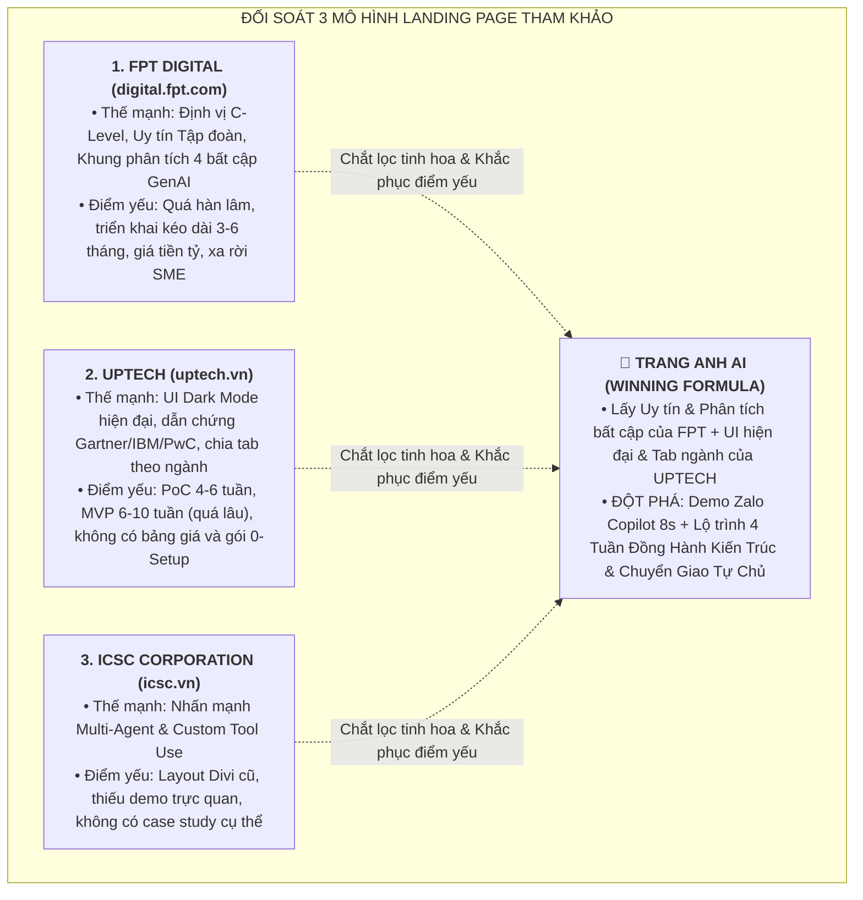

# KẾ HOẠCH TỔNG THỂ XÂY DỰNG LANDING PAGE CHUYỂN ĐỔI CAO (TRANG ANH AI)
## MASTER BLUEPRINT & TECHNICAL IMPLEMENTATION ROADMAP (HIGH-CONVERTING B2B LANDING PAGE)
### ĐỊNH VỊ CHIẾN LƯỢC: ĐỒNG HÀNH KIẾN TRÚC & CHUYỂN GIAO TỰ CHỦ (CO-ARCHITECTURE & AUTONOMOUS TRANSFER)

```text
======================================================================================================
  LANDING PAGE MASTER PLAN: TRANG ANH AI — TRANG BỊ QUY TRÌNH. TINH ANH VẬN HÀNH.
  CHUYÊN TRANG CHUYỂN ĐỔI CAO (CRO 25-POINT) & ĐỊNH VỊ AI AGENT OPERATIONS & WORKFLOW ALIGNMENT
  MÔ HÌNH THỰC THI: ĐỒNG HÀNH KIẾN TRÚC & CHUYỂN GIAO TỰ CHỦ (CO-ARCHITECTURE & AUTONOMOUS TRANSFER)
======================================================================================================
```

> **Hub Ngữ Cảnh Nguồn (SSOT):** [`plans/marketing-context.md`](file:///E:/Projects/done-with-you/plans/marketing-context.md)  
> **Bộ Bản Quyền Thương Hiệu:** **TRANG ANH AI** (*"Trang bị quy trình. Tinh anh vận hành."* — *Elite Systems. Easy Growth.*)  
> **Mục tiêu chuyển đổi cốt lõi:** Chuyển đổi khách hàng tiềm năng C-Level (CEO, Giám đốc kinh doanh, Chủ doanh nghiệp SME B2B) đăng ký **"Khám Sức Khỏe Vận Hành (AI Readiness Audit)"** và đặt lịch **"Live Demo 45 phút trên dữ liệu thật"**, chốt gói chào hàng **"The Ultimate 0-Setup Offer"** (Retainer 6 tháng thu trước Quý 1).

---

## 🔍 1. PHÂN TÍCH & ĐỐI SOÁT 3 WEBSITE THAM KHẢO (BENCHMARK & GAP ANALYSIS)

Nhằm xây dựng một Landing Page đẳng cấp vượt trội, chúng tôi đã tiến hành bóc tách sâu 3 đối thủ và đơn vị công nghệ hàng đầu tại Việt Nam:



### Bảng Đối Soát Tính Năng & Trải Nghiệm Khách Hàng:

| Tiêu chí So Sánh | FPT Digital | UPTECH | ICSC Corp | TRANG ANH AI (Vị Thế Vượt Trội) |
|---|---|---|---|---|
| **Đối tượng Trọng tâm** | Doanh nghiệp Top đầu, Bank | Doanh nghiệp vừa và lớn | Outsourcing đa ngành | **SME B2B Kỹ thuật (5–50 người, 1–3+ Web)** |
| **Mũi khoan Tiếp cận (Wedge)** | Báo cáo tư vấn chiến lược | Đề xuất PoC tùy chỉnh | Tư vấn phần mềm | **Zalo Copilot 8 Giây (Báo giá PDF + VietQR)** |
| **Mô hình Dịch vụ** | Tư vấn lộ trình (Consulting) | Dịch vụ theo dự án (Project) | Phần mềm theo yêu cầu | **Đồng Hành Kiến Trúc & Chuyển Giao Tự Chủ** |
| **Thời gian có kết quả** | 3 – 6 tháng | 10 – 16 tuần (PoC 4-6w) | Chưa xác định | **4 TUẦN BÀN GIAO TRỌN GÓI (Demo Ngày 1)** |
| **Minh bạch Bảng giá** | Ẩn giá (Báo giá theo dự án) | Ẩn giá (Liên hệ sales) | Ẩn giá | **Minh bạch 3 Gói (12.5tr - 24tr - 41.5tr)** |
| **Gói Chào hàng Đột phá** | Không có | Không có | Không có | **The Ultimate 0-Setup Offer (Free Setup 35tr)** |
| **Giải quyết Bảng giá Excel** | Tư vấn chung chung | Tích hợp ERP/DB | Xây dựng theo yêu cầu | **Deterministic SQL Engine + Excel Unmerge** |
| **An toàn Môi trường Zalo** | Không hỗ trợ Zalo cá nhân | Tích hợp Zalo OA | API cơ bản | **Non-invasive Desktop 1-Chạm (100% An toàn)** |

---

## 🎨 2. HỆ THỐNG THIẾT KẾ & BẢNG MÀU THƯƠNG HIỆU (BRAND DESIGN TOKENS)

Học hỏi phong cách hiện đại từ UPTECH kết hợp tính trang nhã, tin cậy từ FPT Digital, Trang Anh AI áp dụng tỷ lệ thị giác vàng **60 - 30 - 10** theo bộ nhận diện **Soft Nordic Tech**:

```text
+---------------------------------------------------------------------------------------------------+
|  MÀU CHỦ ĐẠO (60%)           MÀU NHẬN DIỆN (30%)             MÀU ĐIỂM NHẤN / CTA (10%)            |
|  Deep Slate Charcoal         Brand AI Blue (Soft Iris)       Sage Teal / Growth Green             |
|  HEX: #1E293B                HEX: #4F46E5                    HEX: #0D9488                         |
|  RGB: (30, 41, 59)           RGB: (79, 70, 229)              RGB: (13, 148, 136)                  |
+---------------------------------------------------------------------------------------------------+
```

* **Nền phụ & Card sáng (Light BG):** `Soft Mist White` (`#F8FAFC` / `#FFFFFF`).
* **Đường viền & Phân tách (Borders):** `Subtle Slate Border` (`#E2E8F0`).
* **Cảnh báo & Huy hiệu Hot (Badge/Alert):** `Warm Amber` (`#F59E0B`).
* **Kiểu chữ (Typography):** Inter / Plus Jakarta Sans (Tiêu đề SemiBold/Bold, Body Regular 16px, Line-height 1.6).

---

## 🏛️ 3. CẤU TRÚC 9 SECTION CHUYỂN ĐỔI CAO (9-SECTION HYBRID ARCHITECTURE)

```mermaid
graph TD
    S1["<b>SECTION 1: HERO (Above the Fold)</b><br/>• Eyebrow: Hệ điều hành AI Agent & Đồng Hành Kiến Trúc<br/>• H1: Báo giá chuẩn xác 8s. Tự chủ vận hành trên hạ tầng chính chủ.<br/>• Primary CTA: Đăng ký Khám Sức Khỏe Vận Hành (Sage Teal #0D9488)<br/>• Visual: Mockup tương tác Zalo Copilot 8s ra file PDF Vector"]
    
    S2["<b>SECTION 2: TRUST STATS & 4 BẤT CẬP GENAI (HỌC TỪ FPT & UPTECH)</b><br/>• Dữ liệu Gartner, PwC, AWS, Bộ KH&ĐT (48.8% dừng CĐS)<br/>• Bóc trần 4 Bất cập: Ảo giác, Lệch ngành, Bảo mật & Không cá nhân hóa"]
    
    S3["<b>SECTION 3: PAIN POINTS MATRIX (3 ĐIỂM NGHẼN B2B VIỆT NAM)</b><br/>• 68% mất đơn vì chậm 30p, Nuôi 1 nhân sự tốn 19.3tr, Data rải rác Zalo/Excel"]
    
    S4["<b>SECTION 4: CORE VALUE & ZALO COPILOT INTERACTIVE DEMO</b><br/>• Zalo Copilot 8s (Human-in-the-loop)<br/>• Master RAG Lake (Zero Hallucination SQL-Based)<br/>• Executive BI Dashboard 1-Trang cho CEO"]
    
    S5["<b>SECTION 5: ỨNG DỤNG THEO NGÀNH B2B (INDUSTRY USE CASES TABS)</b><br/>• Tab 1: Hóa chất & Môi trường | Tab 2: Van & Thiết bị M&E | Tab 3: Đa Website Vệ Tinh"]
    
    S6["<b>SECTION 6: LỘ TRÌNH 4 TUẦN KIẾN TRÚC & CHUYỂN GIAO TỰ CHỦ</b><br/>• Tuần 1-2: Kiến trúc RAG Lake & Setup Chính Chủ -> Tuần 3-4: Căn chỉnh luồng & Chuyển giao SOP"]
    
    S7["<b>SECTION 7: 3-TIER PRICING & THE ULTIMATE 0-SETUP OFFER</b><br/>• Gói 1: Nền tảng (12.5tr) | Gói 2: Tăng trưởng (24tr - Hero) | Gói 3: Toàn diện (41.5tr)<br/>• Miễn phí 100% Phí Kiến Trúc & Chuyển Giao khi ký 6 tháng thu trước Quý 1"]
    
    S8["<b>SECTION 8: LEGAL COMPLIANCE & FAQ ACCORDION</b><br/>• Luật 91/2025/QH15, Luật AI 134/2025/QH15, 6 câu hỏi bẻ gãy hoài nghi"]
    
    S9["<b>SECTION 9: LEAD CAPTURE & FAST AUDIT FORM (FINAL CTA)</b><br/>• Form 4 trường tinh gọn, Webhook bắn CRM & Telegram Admin trong 3s"]

    S1 --> S2 --> S3 --> S4 --> S5 --> S6 --> S7 --> S8 --> S9
```



---

## 🧩 4. CHI TIẾT NỘI DUNG TỪNG SECTION (SECTION-BY-SECTION BLUEPRINT)

### Section 1: Hero Section (Above The Fold — Tối Đa Chuyển Đổi Không Cần Cuộn Trang)
* **Badge (Eyebrow):** `🛡️ ĐỐI TÁC KIẾN TRÚC VẬN HÀNH AI AGENT — ĐỒNG HÀNH KIẾN TRÚC & CHUYỂN GIAO TỰ CHỦ`
* **Headline (H1):**
  > **Báo Giá Chuẩn Xác Trong 8 Giây.**  
  > **Tự Chủ Vận Hành Doanh Nghiệp Trên Hạ Tầng Chính Chủ.**
* **Subheadline (H2):**
  > *"Không bán công cụ bỏ mặc, không làm hộ rỗng ruột. Trang Anh AI trực tiếp kiến tạo kho dữ liệu Master RAG Lake, căn chỉnh luồng Zalo Copilot và chuyển giao quy trình SOP để doanh nghiệp làm chủ cỗ máy chỉ sau 4 tuần."*
* **CTA Button (Sage Teal `#0D9488`):** `[ ĐĂNG KÝ KHÁM SỨC KHỎE VẬN HÀNH & LIVE DEMO 45 PHÚT ]`
* **Micro-copy (Giảm ma sát & Bảo mật):** *🔒 Cài đặt trên tài khoản Enterprise chính chủ • Bảo mật 100% theo Luật Dữ Liệu 91/2025/QH15 • Sở hữu vĩnh viễn dữ liệu & quy trình.*
* **Hero Visual:** Mockup giao diện Zalo Copilot mở song song bên cạnh tin nhắn Zalo, minh họa dòng văn bản viết tắt được dịch tự động thành bảng giá PDF Vector Typst có đính kèm mã VietQR trong 8 giây.

---

### Section 2: Dữ Liệu Thực Chứng & 4 Bất Cập Của GenAI Truyền Thống *(Học hỏi từ FPT Digital + UPTECH)*

#### A. 3 Con số thị trường biết nói (Authority Stats):
* **50%** quyết định kinh doanh sẽ được AI Agents hỗ trợ hoặc tự động hóa vào năm 2027 *(Gartner)*.
* **48,8%** doanh nghiệp Việt Nam từng dùng giải pháp Chuyển đổi số rồi **buộc phải dừng lại** do quá phức tạp *(Báo cáo Thường niên CĐS — Bộ KH&ĐT + GIZ)*.
* **41%** nhà quản lý Việt Nam khó chứng minh hiệu quả tài chính ROI từ AI *(Yandex Ads + YouGov)*.

#### B. 4 Bất cập khiến Doanh nghiệp B2B thất vọng với GenAI thông thường (và Giải pháp Trang Anh AI):
1. **Bất cập 1 — Ảo giác & Thiếu tin cậy:** LLM tự tính nhẩm giá tiền gây sai lệch số liệu $\rightarrow$ **Trang Anh AI:** Sử dụng *Deterministic SQL Pricing Engine*, cấm LLM tính nhẩm, chuẩn xác 100% đến từng đồng.
2. **Bất cập 2 — Ngôn ngữ không sát ngành:** AI trả lời chung chung, không hiểu mã hàng kỹ thuật $\rightarrow$ **Trang Anh AI:** *Dual Vectorization (BGE-M3 + BM25)* hiểu sâu TDS, catalogue, tiêu chuẩn QCVN/ASTM.
3. **Bất cập 3 — Rò rỉ dữ liệu & Rủi ro pháp lý:** Nhân viên dán dữ liệu lên AI công cộng vi phạm Luật 91/2025 $\rightarrow$ **Trang Anh AI:** Triển khai 100% trên *Tài khoản Enterprise chính chủ* của khách hàng.
4. **Bất cập 4 — Bội thực công cụ, không nối vào luồng:** Mua nhiều tool nhưng nhân viên không dùng $\rightarrow$ **Trang Anh AI:** Căn chỉnh vào đúng thói quen Zalo qua *Zalo Copilot 1-chạm*.

---

### Section 3: Bức Tranh 3 Nỗi Đau Vận Hành B2B Việt Nam (Market Pain Points)
1. **Bẫy Mất Đơn Do Báo Giá Chậm:** 68% khách hàng B2B chuyển sang đối thủ vì chờ báo giá quá 30 phút.
2. **Bẫy Chi Phí Nuôi Người:** Nuôi 1 nhân sự 12tr tiêu tốn 19.3tr/tháng; làm 6 tháng nhảy việc là mất quy trình.
3. **Bẫy Dữ Liệu Rải Rác:** 90% bảng giá nằm ở file Excel gộp ô rối rắm, catalogue scan mờ và kiến thức "nằm trong đầu" của sếp.

---

### Section 4: Bộ Ba Giải Pháp Đột Phá — Core Value Trang Anh AI
1. **Zalo Copilot 8 Giây (Human-in-the-loop):** Bóc tách tiếng lóng Zalo, truy vấn SQL giá sỉ/lẻ, xuất PDF Typst vector chuẩn in ấn kèm mã VietQR động trong 8 giây.
2. **Master RAG Lake (Zero Hallucination Architecture):** 5 lớp số hóa: Unmerge Excel, Multimodal OCR TDS/CO/CQ, Deterministic Pricing, Dual Vectorization và Cross-Encoder Reranking.
3. **Executive BI Dashboard & Strategic Decision Copilot (M0):** Báo cáo quản trị 1 trang tức thì cho CEO, phát hiện điểm nghẽn doanh thu và mô phỏng kịch bản What-If.

---

### Section 5: Ứng Dụng Thực Tế Theo Ngành B2B (Industry Use-Cases Tabs)

```text
+---------------------------------------------------------------------------------------------------+
| [ TAB 1: HÓA CHẤT & XỬ LÝ NƯỚC ]  | [ TAB 2: VAN & THIẾT BỊ CƠ ĐIỆN ] | [ TAB 3: ĐA WEBSITE VỆ TINH ]     |
+---------------------------------------------------------------------------------------------------+
| • Bóc tách tiếng lóng: "than gd 6-12", "hạt cation C100E", "PAC vàng", "màng RO 8040".          |
| • Tra cứu tự động TDS, chứng chỉ CO/CQ, bảng kết quả thử nghiệm Quatest trong 5 giây.             |
| • Tính toán thể tích bồn lọc, lưu lượng m3/h và xuất BOQ vật tư hoàn chỉnh trong 2 phút.          |
+---------------------------------------------------------------------------------------------------+
```

---

### Section 6: Lộ Trình 4 Tuần: Đồng Hành Kiến Trúc & Chuyển Giao Tự Chủ
*So sánh tốc độ: FPT Digital (3–6 tháng) vs UPTECH (10–16 tuần) vs **Trang Anh AI (4 Tuần Đồng Hành & Chuyển Giao Trọn Gói)**:*

* **GIAI ĐOẠN 1 (Tuần 1–2): ĐỒNG HÀNH KIẾN TRÚC HẠ TẦNG** *(Trang Anh AI gánh 90% kỹ thuật)*
  * **Tuần 1:** Audit Dữ Liệu, Unmerge Bảng Giá Excel & Xây Dựng Master RAG Lake (Zero Hallucination).
  * **Tuần 2:** Cài đặt Hệ Thống Multi-Agent trên Tài Khoản Enterprise Chính Chủ của Khách Hàng.
* **GIAI ĐOẠN 2 (Tuần 3–4): CĂN CHỈNH LUỒNG & CHUYỂN GIAO TỰ CHỦ** *(Đưa nhân sự vào làm chủ cỗ máy)*
  * **Tuần 3:** Căn Chỉnh Luồng: Zalo Copilot 8s $\rightarrow$ Chatbot CSKH 24/7 $\rightarrow$ Dashboard CEO.
  * **Tuần 4:** Đào Tạo 3 Tầng Nhân Sự (Operator, Maintainer, Supervisor) & Bàn Giao SOP Tự Chủ Vận Hành.

---

### Section 7: Bảng Giá 3 Gói Retainer & "The Ultimate 0-Setup Offer"

| Quyền lợi & Tính năng | GÓI 1: NỀN TẢNG | GÓI 2: TĂNG TRƯỞNG (⭐ Hero) | GÓI 3: TOÀN DIỆN |
|---|---|---|---|
| **Phí Retainer Đồng Hành Hàng Tháng** | **12.500.000 đ/tháng** | **24.000.000 đ/tháng** | **41.500.000 đ/tháng** |
| **Phí Kiến Trúc Master Lake & Chuyển Giao SOP** | ~~20.000.000 đ~~ $\rightarrow$ **MIỄN PHÍ** | ~~25.000.000 đ~~ $\rightarrow$ **MIỄN PHÍ** | ~~35.000.000 đ~~ $\rightarrow$ **MIỄN PHÍ** |
| **Kỳ hạn HĐ & Thanh toán** | 06 tháng (Thu trước Quý 1: 37.5tr) | 06 tháng (Thu trước Quý 1: 72.0tr) | 06 tháng (Thu trước Quý 1: 124.5tr) |
| **Quy mô Website Quản trị** | 01 Website chính | **1 – 3 Website vệ tinh tập trung** | 3 – 5+ Website vệ tinh |
| **Zalo Copilot Báo Giá 8s** | — | **Có (Đầy đủ tính năng báo giá 8s)** | Có (Báo giá 8s + Chiết khấu nâng cao) |
| **AI Sales & CSKH 24/7** | LiveChat Web cơ bản | **LiveChat Web + Fanpage + Zalo OA** | Toàn kênh đa nền tảng |
| **Executive BI Dashboard** | Báo cáo tháng | **Dashboard 1 Trang Real-time** | BI Dashboard + Mô phỏng What-If |
| **Bảo Đảm Hoàn Tiền QBR** | Ngày thứ 75 | **Ngày thứ 75 (Hoàn tiền 100%)** | Ngày thứ 75 (Hoàn tiền 100%) |

* **Banner Đột Phá:**  
  > 🎁 **THE ULTIMATE 0-SETUP OFFER:** **TẶNG MIỄN PHÍ 100% PHÍ KIẾN TRÚC & CHUYỂN GIAO (TIẾT KIỆM ĐẾN 35 TRIỆU)** khi ký Hợp đồng Retainer 6 tháng thu trước Quý 1. Áp dụng cho **20 Doanh nghiệp Tiên phong**.

---

### Section 8: Lá Chắn Pháp Lý & Câu Hỏi Thường Gặp (FAQ Accordion)
* **Bảo mật tuyệt đối:** Tuân thủ Luật Bảo vệ Dữ liệu Cá nhân **91/2025/QH15** (Nghị định 356/2025/NĐ-CP) và Luật AI **134/2025/QH15**.
* **FAQ Bẻ Gãy Hoài Nghi:**
  1. *Nói "Đồng hành kiến trúc & Chuyển giao tự chủ" thì bên tôi có phải làm nhiều việc không?* $\rightarrow$ Không! Trang Anh AI trực tiếp gánh 90% khối lượng kỹ thuật (làm sạch Excel, xây RAG Lake, viết code bóc tách, cài đặt Zalo Copilot). Doanh nghiệp chỉ cần cung cấp file ban đầu và cử nhân sự tham gia 2 buổi nhận bàn giao SOP tại Tuần 4.
  2. *Dùng Zalo Copilot có bị Zalo khóa tài khoản không?* $\rightarrow$ Không! Hoạt động ở tầng Desktop Shortcut, không can thiệp API ngầm.
  3. *Nếu bảng giá Excel gộp ô phức tạp AI có đọc sai không?* $\rightarrow$ Không! Chuyển đổi thành Deterministic SQL Database, chính xác 100%.
  4. *Chính sách Cam kết Hoàn tiền Ngày 75 (QBR) thế nào?* $\rightarrow$ Không tiết kiệm $\ge 30$ giờ/tháng $\rightarrow$ Hoàn tiền 100% phí tháng tiếp theo, khách giữ vĩnh viễn dữ liệu đã làm sạch.

---

### Section 9: Form Đăng Ký Khám Sức Khỏe Vận Hành (Final Lead Capture)
* **Form Fields:**
  1. *Họ và Tên Quản lý / Giám đốc* (Bắt buộc)
  2. *Số điện thoại / Zalo kết nối* (Bắt buộc)
  3. *Tên Doanh nghiệp & Ngành nghề B2B* (Bắt buộc)
  4. *Số lượng website hoặc quy mô đội Sales* (Dropdown nhanh)
* **Nút bấm CTA (Màu Sage Teal `#0D9488`):** `[ GỬI THÔNG TIN — NHẬN BÁO CÁO AUDIT & ĐẶT LỊCH LIVE DEMO ]`
* **Micro-copy Bảo mật:** *🔒 Bảo mật 100% theo tiêu chuẩn ISO 27001 và Luật 91/2025/QH15.*

---

## 💻 5. KIẾN TRÚC CÔNG NGHỆ THỰC THI (TECH STACK)

* **Frontend:** Next.js 14+ (App Router, Server Components) + Tailwind CSS + Lucide Icons + Framer Motion.
* **Tốc độ Core Web Vitals:** LCP $< 1.2\text{s}$, FID/INP $< 100\text{ms}$, CLS $< 0.05$ (Điểm PageSpeed $\ge 95$).
* **SEO & GEO Schema:** Cấu trúc JSON-LD (`Organization`, `ProfessionalService`, `Product`, `FAQPage`) tối ưu trích dẫn AI Search (ChatGPT, Gemini, Perplexity).
* **Form & Webhook:** React Hook Form + Zod validation $\rightarrow$ API Route `/api/leads` $\rightarrow$ Webhook tự động đồng bộ CRM (MISA AMIS / Brevo) và gửi thông báo Telegram Admin tức thì trong 3 giây.

---

## 📅 6. LỘ TRÌNH 4 SPRINT TRIỂN KHAI

| Sprint | Thời gian | Nội dung triển khai chính | Tiêu chí hoàn thành (Deliverable) |
|---|---|---|---|
| **Sprint 1** | 2 ngày | Khởi tạo Next.js App, cấu hình Tailwind Tokens (`#1E293B`, `#4F46E5`, `#0D9488`), Layout Header/Footer. | Khung repo sạch & Brand theme chuẩn |
| **Sprint 2** | 3 ngày | Dựng Hero tương tác, Bảng 4 Bất cập GenAI, Bảng nỗi đau, 3 Trụ cột, Tab Ngành B2B, Lộ trình 4 tuần, Bảng giá 3 gói và FAQ. | Toàn bộ giao diện Desktop & Mobile hoàn chỉnh |
| **Sprint 3** | 2 ngày | Lập trình Lead Form, Honeypot chống spam, API Route `/api/leads`, Webhook bắn CRM & Email tự động qua Resend. | Luồng thu Lead & Automation kích hoạt 100% |
| **Sprint 4** | 2 ngày | Audit CRO 25 tiêu chí, kiểm thử Zalo In-App Browser, tối ưu Core Web Vitals $\ge 95$ và trỏ Domain chính thức. | Landing Page chính thức xuất bản |

---
*Kế hoạch được cập nhật định vị mới bởi **TRANG ANH AI** — Sẵn sàng tiến hành lập trình mã nguồn.*
