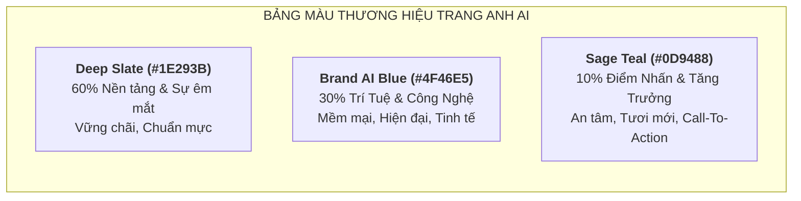
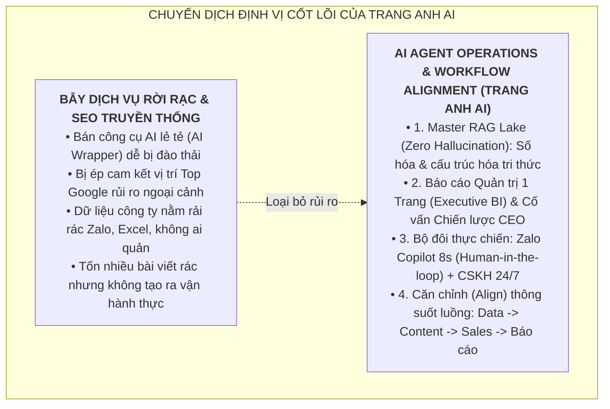
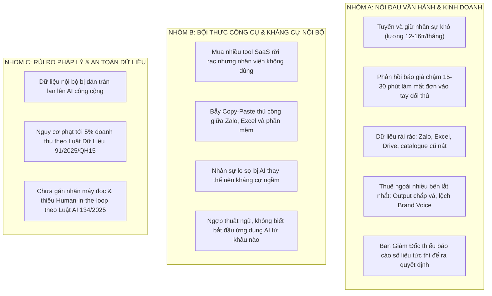
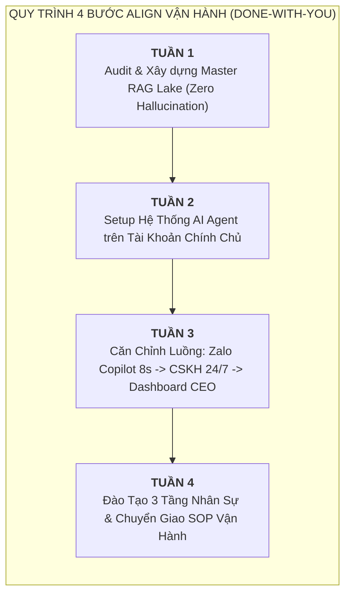
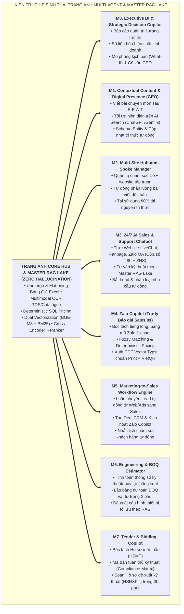
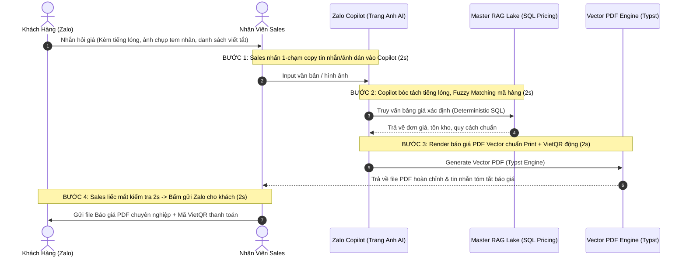
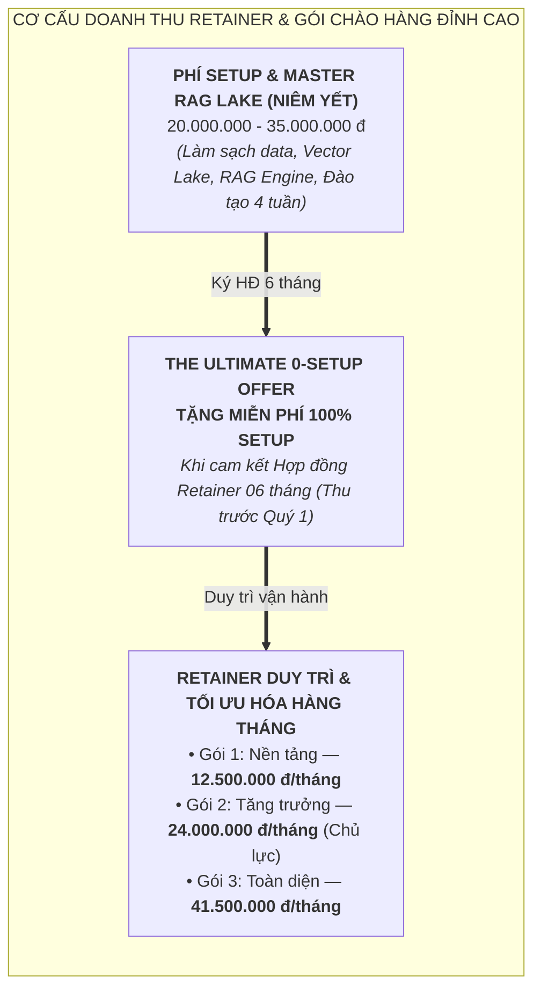
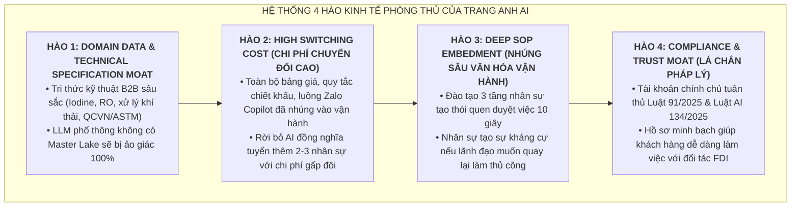
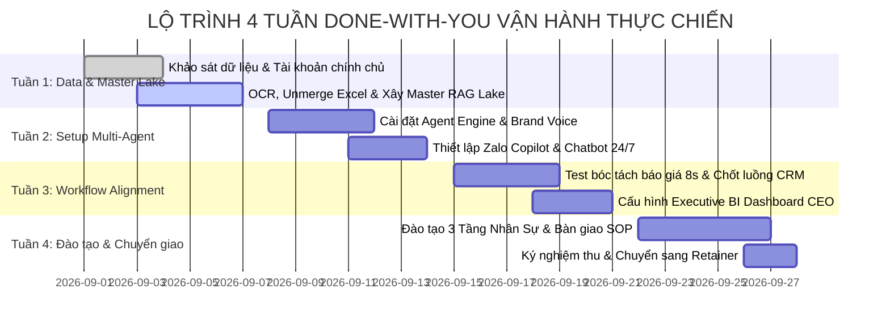

# TRANG ANH AI — MARKETING CONTEXT & STRATEGIC PROPOSAL HUB
## SINGLE SOURCE OF TRUTH (SSOT) — HỆ ĐIỀU HÀNH AI AGENT & CĂN CHỈNH LUỒNG DOANH NGHIỆP

```text
======================================================================================================
  _____ ____      _    _   _  ____      _    _   _ _   _      _    ___ 
 |_   _|  _ \    / \  | \ | |/ ___|    / \  | \ | | | | |    / \  |_ _|
   | | | |_) |  / _ \ |  \| | |  _    / _ \ |  \| | |_| |   / _ \  | | 
   | | |  _ <  / ___ \| |\  | |_| |  / ___ \| |\  |  _  |  / ___ \ | | 
   |_| |_| \_\/_/   \_\_| \_|\____| /_/   \_\_| \_|_| |_| /_/   \_\___|
  TRANG ANH AI — TRANG BỊ QUY TRÌNH. TINH ANH VẬN HÀNH. (ELITE SYSTEMS. EASY GROWTH.)
  AI AGENT OPERATIONS & WORKFLOW ALIGNMENT — ĐỒNG HÀNH KIẾN TRÚC & CHUYỂN GIAO (DONE-WITH-YOU)
======================================================================================================
```

> **Đơn vị phát triển:** **TRANG ANH AI** (Trang Anh Systems Vietnam)  
> **Ý nghĩa tên gọi:** *"Trang"* (Trang bị, Chuẩn mực, Trang nhã) — Trang bị cỗ máy tự chủ và quy trình chuẩn mực; *"Anh"* (Tinh anh, Anh minh, Trí tuệ) — Hội tụ trí tuệ xuất chúng và giải pháp thông thái.  
> **Thông điệp cốt lõi (Tagline):** **"Trang bị quy trình. Tinh anh vận hành."** *(Elite Systems. Easy Growth.)*  
> **Lĩnh vực định vị cốt lõi:** **AI AGENT OPERATIONS & WORKFLOW ALIGNMENT** *(Hệ Thống AI Agent Vận Hành & Căn Chỉnh Luồng Công Việc Doanh Nghiệp)*  
> **Kim chỉ nam:** *"Không bán công cụ rời rạc, không sa đà vào dịch vụ SEO cam kết thứ hạng rủi ro — Triển khai Hệ thống Multi-Agent Chuyên trách làm Bộ não Phân tích Ngữ cảnh để căn chỉnh (Align) toàn bộ tài nguyên, dữ liệu và quy trình nội bộ vào một Luồng Vận Hành Doanh Nghiệp Tự Chủ trên hạ tầng chính chủ"*  
> **Nền tảng công nghệ thực thi:** **Antigravity Engine** kết hợp **Google AI Pro (Gemini 1M–2M Context Window, Native Multimodal, Code Execution)**  
> **Mô hình kinh doanh cốt lõi (Core Business Model):** **Managed AI Agent Operations & Workflow Retainer** (Gói chào hàng đỉnh cao: Miễn phí 100% Setup khi cam kết Retainer 6 tháng thu trước theo Quý).  
> **Chuẩn mực tuân thủ:** Luật Bảo vệ Dữ liệu Cá nhân **91/2025/QH15** (Nghị định 356/2025/NĐ-CP) & Luật Trí tuệ Nhân tạo **134/2025/QH15**  
> **Trạng thái tài liệu:** Hub Ngữ Cảnh & Bản Đề Xuất Chiến Lược Hợp Nhất (Single Source of Truth - SSOT)  
> **Phiên bản cập nhật:** 2026.3.0 (Cập nhật toàn diện tháng 08/2026)  

---

## 🎨 HỆ THỐNG NHẬN DIỆN THƯƠNG HIỆU (BRAND IDENTITY & COLOR SYSTEM)

### 1. Triết Lý Thương Hiệu: **TRANG ANH AI**
* **Tính cách thương hiệu:** Nhẹ nhàng, Tinh tế, Thông thái, Chuẩn mực, Đáng tin cậy, Thực tế.
* **Lời hứa thương hiệu:** Xóa bỏ sự phức tạp và nỗi sợ công nghệ, trang bị cho doanh nghiệp nền tảng AI Agent tinh anh để làm chủ vận hành một cách tự nhiên, an toàn và dễ dàng nhất.

---

### 2. Hệ Thống Màu Sắc Chuẩn: **Brand AI Blue Palette (Soft Nordic Tech)**

Hệ màu của **TRANG ANH AI** kết hợp giữa sắc xanh **Brand AI Blue** êm dịu, sắc **Deep Slate** vững chãi và điểm nhấn **Sage Teal** thanh mát theo tỷ lệ thị giác vàng **60 - 30 - 10**:

```text
+---------------------------------------------------------------------------------------+
|  MÀU CHỦ ĐẠO (60%)           MÀU NHẬN DIỆN (30%)             MÀU ĐIỂM NHẤN (10%)      |
|  Deep Slate Charcoal         Brand AI Blue (Soft Iris)       Sage Green / Teal        |
|  HEX: #1E293B                HEX: #4F46E5                    HEX: #0D9488             |
|  RGB: (30, 41, 59)           RGB: (79, 70, 229)              RGB: (13, 148, 136)      |
+---------------------------------------------------------------------------------------+
```



#### Bảng thông số màu chi tiết (Color Tokens):

| Vai trò màu | Tên màu | Mã HEX | Mã RGB | Ứng dụng trong Tài liệu & Giao diện |
|---|---|---|---|---|
| **Chủ đạo (Base - 60%)** | **Deep Slate** | `#1E293B` | `30, 41, 59` | Màu chữ chính, tiêu đề H1/H2, khung nền tối lịch thiệp, dễ chịu cho mắt. |
| **Nhận diện (Brand - 30%)** | **Brand AI Blue** | `#4F46E5` | `79, 70, 229` | Màu nhận diện Agent, nút chức năng, icon công nghệ, đường liên kết sơ đồ. |
| **Điểm nhấn (Accent - 10%)** | **Sage Teal** | `#0D9488` | `13, 148, 136` | Nút Kêu gọi hành động (CTA), số liệu ROI, nhãn trạng thái hoàn thành. |
| **Lưu ý / Highlight** | **Warm Amber** | `#F59E0B` | `245, 158, 11` | Cảnh báo an toàn dữ liệu, lưu ý điều khoản hợp đồng. |
| **Nền sáng (Light BG)** | **Soft Mist White** | `#F8FAFC` | `248, 250, 252` | Nền tài liệu, nền thẻ card dịch vụ thoáng đãng. |
| **Đường kẻ / Border** | **Subtle Slate Border** | `#E2E8F0` | `226, 232, 240` | Viền bảng biểu, phân tách khối nội dung nhẹ nhàng. |

---

## 1. NGUYÊN TẮC CHIẾN LƯỢC: ĐỊNH VỊ "AI AGENT OPERATIONS & WORKFLOW ALIGNMENT"



### 3 Trụ Cột Định Vị Cốt Lõi:
1. **Hệ thống hóa nguồn dữ liệu & Master RAG Lake (Zero Hallucination):** Toàn bộ dữ liệu doanh nghiệp (Bảng giá Excel gộp ô phức tạp, catalogue, thông số kỹ thuật TDS, quy trình SOP, hồ sơ CO/CQ, tiêu chuẩn QCVN/ASTM) được gom và số hóa thành **Master Knowledge Lake**. Kiến trúc RAG kết hợp **Dual Vectorization (BGE-M3 + BM25)**, **Parent-Child Chunking**, **Cross-Encoder Reranker** và **Deterministic SQL Pricing Engine** giúp Agent tra cứu chính xác 100% đến từng mã hàng, điều khoản và thông số, khử sạch hoàn toàn lỗi ảo giác.
2. **Executive BI Dashboard & Trợ lý Ra Quyết Định Chiến Lược (CEO Copilot):** Tự động số liệu hóa các chỉ số kinh doanh thành **Báo Cáo Quản Trị 1 Trang (1-Page CEO Executive Dashboard)**. Agent đóng vai trò Cố vấn Chiến lược: phân tích điểm nghẽn dòng tiền, phát hiện sản phẩm biên lợi nhuận thấp, mô phỏng kịch bản kinh doanh (What-If Analysis) giúp Ban Giám Đốc ra quyết định dựa trên dữ liệu thực chứng (Data-driven).
3. **Căn chỉnh luồng công việc liền mạch (Workflow Alignment):** Kết nối thông suốt toàn diện: *Khách hàng tìm kiếm (AI Search/GEO) $\rightarrow$ Chatbot CSKH 24/7 tiếp nhận $\rightarrow$ Zalo Copilot bóc tách và tạo báo giá PDF trong 8 giây $\rightarrow$ Sales kiểm tra 10 giây và gửi $\rightarrow$ Báo cáo cập nhật tức thì lên Executive Dashboard*.

---

## 2. BỨC TRANH THỊ TRƯỜNG & DỮ LIỆU THỰC CHỨNG VIỆT NAM

| Chỉ số thị trường | Con số thực chứng | Nguồn dữ liệu uy tín | Góc nhìn chiến lược của TRANG ANH AI |
|---|---|---|---|
| **Mức độ thâm nhập AI** | **18%** doanh nghiệp đã tiếp cận AI, nhưng **74%** mới dừng ở mức cơ bản; chỉ **1%** đạt độ trưởng thành vận hành. | Báo cáo AWS + Strand Partners (*Unlocking Vietnam's AI Potential*) & ĐHQG TP.HCM | Thị trường cần giải pháp nâng cấp thành "Hệ thống AI Agent vận hành doanh nghiệp bài bản". |
| **Khoảng cách năng lực** | **55%** DN gặp rào cản lớn về kỹ năng; **76%** không tự tin vào năng lực tự triển khai nội bộ. | Báo cáo AWS + Strand Partners | Mua tool về tự mày mò gây lãng phí; doanh nghiệp cần phương pháp Done-With-You đồng hành. |
| **Nút thắt chuyển đổi số** | **Chỉ 2,2%** DN làm chủ dữ liệu để ra quyết định; **48,8%** từng dùng giải pháp CĐS rồi **buộc phải dừng**. | Báo cáo Thường niên CĐS — Bộ KH&ĐT + GIZ (n≈1.300) | Tỷ lệ dừng gần 50% cho thấy giải pháp phải rất tinh gọn, giải quyết dữ liệu sạch ngay từ đầu. |
| **Khó khăn đo lường ROI** | **41%** quản lý Việt Nam khó chứng minh hiệu quả tài chính từ AI (cao nhất ĐNA). | Yandex Ads (*Clear Signal*) + YouGov (n=649) | TRANG ANH AI tập trung vào kết quả vận hành: thời gian ra báo giá 8s, dữ liệu đồng bộ, giờ công tiết kiệm. |
| **Rào cản ngân sách ban đầu** | **49%** DN vừa/lớn (UOB) và **53,3%** DN thương mại (Sapo) e ngại chi phí đầu tư ban đầu quá cao. | UOB Business Outlook 2026 & Báo cáo Sapo | Đột phá với **The Ultimate 0-Setup Offer**: Miễn phí 100% Setup khi ký Retainer 6 tháng. |

---

## 3. BẢN ĐỒ 4 NHÓM NỖI ĐAU VẬN HÀNH CỦA DOANH NGHIỆP SME



---

## 4. MÔ HÌNH DONE-WITH-YOU: ĐỒNG HÀNH & CHUYỂN GIAO NĂNG LỰC VẬN HÀNH

**TRANG ANH AI không bán phần mềm đóng kín, không bán dịch vụ agency chắp vá. Chúng tôi là Đối tác Kiến trúc Vận hành & Căn chỉnh Luồng Doanh nghiệp bằng AI Agent:**



### 4 Cam Kết Vàng Về Kiến Trúc:
1. **Dữ liệu không bao giờ rời doanh nghiệp:** Hệ thống được thiết lập trực tiếp trên tài khoản Enterprise chính chủ của khách hàng (Google Workspace / ChatGPT Team / Claude Team). Tuân thủ 100% **Luật Bảo vệ Dữ liệu Cá nhân 91/2025/QH15** (Nghị định 356/2025/NĐ-CP).
2. **Master RAG Lake (Zero Hallucination):** Gom bảng giá, catalogue, tài liệu kỹ thuật, quy trình SOP thành kho Vector Hub chuẩn xác với thuật toán phân giải ngữ cảnh chuyên sâu.
3. **Human-in-the-loop (Con người kiểm soát & duyệt cuối):** AI Agent chuẩn bị 95% công việc (soạn thảo, tra cứu, tính toán báo giá), nhân viên kiểm tra 10 giây và bấm gửi. Tuân thủ **Luật AI 134/2025/QH15**.
4. **Sở hữu tài sản trọn đời:** Doanh nghiệp sở hữu vĩnh viễn dữ liệu thô, cơ sở dữ liệu đã chuẩn hóa, các bản báo giá PDF đã tạo và tài liệu quy trình chuẩn (SOP).

---

## 5. IDEAL CUSTOMER PROFILE (ICP) & 4 BUYER PERSONAS

### 5.1. Chân dung Khách hàng Mục tiêu (ICP)
* **Quy mô:** Doanh nghiệp nhỏ, vừa nhỏ và siêu nhỏ (Micro & Small SMEs từ 5 – 50 nhân sự; doanh thu từ 5 – 100 tỷ VNĐ/năm).
* **Ngành nghề trọng tâm:** B2B Kỹ thuật, Công nghiệp, Phân phối Vật tư & Thiết bị, Sản xuất gia công, Dịch vụ kỹ thuật phụ trợ (Hóa chất, xử lý môi trường, vật liệu lọc, cơ khí, bao bì, cơ điện M&E).
* **Mô hình mạng lưới Đa Website:** Doanh nghiệp sở hữu từ **1 đến 3+ website vệ tinh** cần phân luồng chăm sóc nội dung đồng bộ mà không cần thuê nhiều agency ngoài.

### 5.2. Bốn Nhóm Persona Mua Hàng Điển Hình
1. **Persona A — Chủ Doanh Nghiệp Truyền Thống (45–60 tuổi):** Ngại công nghệ phức tạp; nỗi đau mất đơn do báo giá chậm và thiếu báo cáo số liệu rõ ràng; cần giải pháp đơn giản, có người làm cùng (Done-With-You).
2. **Persona B — Lãnh Đạo Kế Nghiệp F2 (28–40 tuổi):** Thích đổi mới; nỗi đau đụng chạm văn hóa cũ và thiếu số liệu ra quyết định; cần hệ thống AI Agent tinh gọn, đo được ROI cụ thể.
3. **Persona C — Trưởng Phòng Sales / Kỹ Thuật:** Bị quá tải việc giấy tờ; cần Trợ lý Báo giá Zalo Copilot giải phóng 80% thời gian bóc tách giá thủ công.
4. **Persona D — Doanh Nghiệp Sở Hữu Đa Website (≥3 Sites):** Quá tải quản trị nhiều website; sợ trùng lặp nội dung; cần 1 Hub trung tâm tự động phân luồng chăm sóc 3–10 site.

---

## 6. HỆ SINH THÁI 8 MODULE GIẢI PHÁP TRANG ANH MULTI-AGENT & MASTER RAG LAKE

TRANG ANH AI xây dựng hệ thống các trợ lý AI Agent chuyên trách kết nối mượt mà theo kiến trúc **Hub-and-Spoke** xoay quanh **Master RAG Lake**:



---

## 7. CHI TIẾT ĐỘT PHÁ CÔNG NGHỆ: MASTER RAG LAKE & ZALO COPILOT 8 GIÂY

### 7.1. Kiến Trúc Master RAG Lake (Zero Hallucination Architecture)

Để đảm bảo tỷ lệ ảo giác = 0% (Zero Hallucination) trong các ngành B2B Kỹ thuật, TRANG ANH AI áp dụng quy trình xử lý dữ liệu 5 lớp:

```text
+---------------------------------------------------------------------------------------------------+
|                  5 LỚP KIẾN TRÚC MASTER RAG LAKE (ZERO HALLUCINATION PIPELINE)                    |
+---------------------------------------------------------------------------------------------------+
| 1. EXCEL UNMERGE & FLATTENING ENGINE:                                                             |
|    Tự động gỡ gộp ô (unmerge), chuẩn hóa cấu trúc bảng giá nhiều tầng, ánh xạ chính xác          |
|    Mã hàng - Quy cách - Đơn vị tính - Bảng giá sỉ/lẻ - Tồn kho.                                   |
|                                                                                                   |
| 2. MULTIMODAL OCR & DOCUMENT DIGITIZER:                                                           |
|    Nhận diện và bóc tách tài liệu scan mờ, catalogue kỹ thuật, bảng thông số TDS, chứng nhận      |
|    CO/CQ, Quatest, tiêu chuẩn QCVN/ASTM bằng Native Multimodal OCR.                               |
|                                                                                                   |
| 3. DETERMINISTIC PRICING ENGINE (SQL-BASED):                                                      |
|    Tuyệt đối không để LLM tự tính nhẩm giá tiền. Mọi phép nhân/chia chiết khấu được chuyển thành   |
|    truy vấn Structured Query (SQL) hoặc Code Execution chính xác 100% đến từng đồng.              |
|                                                                                                   |
| 4. DUAL VECTORIZATION & HYBRID SEARCH:                                                            |
|    Kết hợp Dense Vector (BGE-M3) hiểu sâu ngữ nghĩa + Sparse Vector (BM25) bắt chính xác mã hiệu   |
|    kỹ thuật (ví dụ: than Iodine 900, màng RO 8040, ống uPVC D110).                               |
|                                                                                                   |
| 5. PARENT-CHILD CHUNKING & CROSS-ENCODER RERANKING:                                               |
|    Truy xuất đoạn nhỏ (Child chunk) để khớp ngữ nghĩa chính xác, nhưng trả về toàn bộ ngữ cảnh lớn |
|    (Parent chunk) cho LLM xử lý. Reranker chấm điểm lại để chọn top tài liệu phù hợp nhất.       |
+---------------------------------------------------------------------------------------------------+
```

---

### 7.2. Cơ Chế Zalo Copilot — Trợ Lý Báo Giá 1-Chạm 8 Giây (Non-invasive & 100% An Toàn)

Nút thắt lớn nhất của sales B2B Việt Nam là **giao dịch qua Zalo cá nhân/nhóm Zalo** (nơi không có API công khai hợp lệ). Việc cố tình dùng bot lậu can thiệp API sẽ dẫn tới nguy cơ **bị khóa số điện thoại vĩnh viễn**.

TRANG ANH AI giải quyết triệt để bằng cơ chế **Zalo Copilot 1-Chạm 8 Giây (Human-in-the-loop)**:



#### Ưu thế vượt trội của Zalo Copilot 8s:
1. **An toàn tuyệt đối 100%:** Không can thiệp API ngầm của Zalo, không lo khóa tài khoản.
2. **Khử sạch tiếng lóng & chữ viết tắt:** Tự động hiểu *"than hoat tinh gao dua 6-12"* $\rightarrow$ *Mã hàng: THT-GD-0612, Quy cách: Bao 25kg, Đơn giá: 28.000 đ/kg*.
3. **Báo giá Vector Typst siêu đẹp có VietQR:** File PDF vector sắc nét chuẩn in ấn, tích hợp sẵn mã VietQR động chứa chính xác số tiền và cú pháp thanh toán đơn hàng.
4. **Tuân thủ Luật AI 134/2025/QH15:** Luôn có con người kiểm tra (Human-in-the-loop) 2–5 giây trước khi gửi.

---

## 8. NỀN TẢNG THỰC THI: ANTIGRAVITY ENGINE & GOOGLE AI PRO

TRANG ANH AI ứng dụng nền tảng công nghệ mạnh mẽ nhất hiện nay để hiện thực hóa hệ sinh thái:

```text
+---------------------------------------------------------------------------------------------------+
|                  CỖ MÁY THỰC THI: ANTIGRAVITY ENGINE & GOOGLE AI PRO PLATFORM                     |
+---------------------------------------------------------------------------------------------------+
| 1. GOOGLE AI PRO (GEMINI 1.5/2.0 PRO FOUNDATION):                                                 |
|    • Siêu Context Window (1.000.000 – 2.000.000 Tokens): Nạp trọn vẹn toàn bộ catalogue,          |
|      hồ sơ thầu 500 trang, lịch sử giao dịch nhiều năm mà không sợ mất ngữ cảnh.                  |
|    • Native Multimodal: Tiếp nhận trực tiếp bản vẽ kỹ thuật, sơ đồ CAD, hình ảnh tem nhãn máy móc |
|      và tin nhắn thoại (Voice Memo Zalo) từ công trường.                                          |
|    • Code Execution Engine: Tự động chạy mã Python nội bộ để tính toán dự toán BOQ, công thức     |
|      thủy lực và bảng giá chuẩn xác 100% không qua làm tròn sai lệch.                             |
|                                                                                                   |
| 2. ANTIGRAVITY AGENTIC ORCHESTRATION ENGINE:                                                      |
|    • Quản lý và điều phối luồng Multi-Agent đa luồng, tự động kích hoạt Agent phù hợp.            |
|    • Quản trị bộ nhớ dài hạn (Long-term Context Persistence) và nhật ký log tuân thủ pháp lý.     |
|    • Bảo mật tài khoản chính chủ (Enterprise Private Workspace) độc lập tuyệt đối.                 |
+---------------------------------------------------------------------------------------------------+
```

---

## 9. MA TRẬN 7 VỊ TRÍ NHÂN SỰ ĐƯỢC TRANG ANH AI HỖ TRỢ & NÂNG CẤP

| Vị trí nhân sự trong công ty | Vai trò Trợ lý AI chuyên trách | Các tác vụ thủ công được AI giải phóng | Giá trị thực tế mang lại cho nhân sự & doanh nghiệp |
|---|---|---|---|
| **1. Ban Giám Đốc (CEO / COO / Managing Director)** | **Executive BI Dashboard & Strategic Decision Copilot (M0)** | • Không còn phải chờ nhân viên tổng hợp báo cáo thủ công mất vài ngày.<br/>• Tự động phân tích điểm nghẽn kinh doanh & động thái đối thủ. | Nhận **Báo cáo quản trị 1 trang tức thì** (Doanh thu, Lead, Tỷ lệ chốt, ROI); tư vấn các kịch bản chiến lược dựa trên dữ liệu thực chứng (Data-driven). |
| **2. Nhân Viên Kinh Doanh (Sales Executive / Telesales)** | **Zalo Copilot & B2B Quote Assistant (M4)** | • Bỏ khâu tra cứu mã hàng, quy cách và tính toán giá sỉ thủ công.<br/>• Bỏ khâu tự canh giờ nhắc lịch chăm sóc khách hàng. | Xuất **file báo giá PDF chuẩn trong 8 giây**; nhận kịch bản tư vấn & xử lý từ chối gợi ý theo từng ngành; giải phóng **2–3 giờ làm việc/ngày**. |
| **3. Chuyên Viên Marketing & Nội Dung (Marketing Specialist)** | **Contextual Content & Multi-Site Engine (M1, M2)** | • Không còn cạn kiệt ý tưởng hay viết bài chung chung thiếu chiều sâu kỹ thuật.<br/>• Bỏ khâu copy-paste và chỉnh sửa thủ công trên từng website vệ tinh. | Sản xuất **8–12 bài viết chuyên sâu/tháng** chuẩn E-E-A-T dựa trên Master RAG Lake; tự động chăm sóc và phân luồng nội dung cho **1–3 website vệ tinh** cùng lúc. |
| **4. Kỹ Sư Kỹ Thuật & Dự Toán (Technical Estimator)** | **Engineering Sizing & BOQ Estimator (M6)** | • Bỏ khâu tra bảng công thức tính thể tích, lưu lượng và phụ kiện.<br/>• Không còn nỗi lo cộng nhầm giá vật tư hay thiếu linh kiện trong dự toán. | Nhập thông số hiện trường $\rightarrow$ AI tính toán thủy lực và xuất **Bảng dự toán chi phí (BOQ) hoàn chỉnh trong 2 phút**, chuẩn xác 100% theo giá kho bãi. |
| **5. Chuyên Viên Đấu Thầu (Bidding & Tender Specialist)** | **AI Tender & Bidding Copilot (M7)** | • Không phải ngồi 3–5 ngày đọc từng trang Hồ sơ mời thầu (HSMT).<br/>• Bỏ khâu tìm kiếm và đính kèm thủ công từng chứng thư Quatest, CO/CQ, MSDS. | Rút ngắn thời gian lập hồ sơ đề xuất kỹ thuật từ **3–5 ngày xuống 30 phút**; tự động xuất **Ma trận tuân thủ tiêu chuẩn (Compliance Matrix)** và Biện pháp thi công (BPTC). |
| **6. Nhân Viên CSKH & Lễ Tân (Customer Service / Support)** | **24/7 AI Sales & Support Chatbot (M3)** | • Không phải túc trực trả lời những câu hỏi lặp lại về thông số, catalog ngoài giờ.<br/>• Bỏ việc ghi chép tay lịch bảo dưỡng định kỳ của từng khách hàng. | **Trực kênh 24/7/365** trên Web LiveChat, Fanpage, Zalo OA dựa trên Master RAG Lake; tự động phân loại yêu cầu và gửi nhắc lịch bảo trì O&M trước 30 ngày. |
| **7. Quản Lý Nhân Sự & Đào Tạo (HR & Internal Onboarding)** | **Internal Knowledge & SOP Onboarding Copilot** | • Giảm 70% thời gian quản lý cấp trung phải ngồi cầm tay chỉ việc cho người mới.<br/>• Tránh tình trạng kiến thức công ty bị mất đi khi nhân viên kỳ cựu nghỉ việc. | Nhân viên mới vào hỏi trực tiếp trợ lý về văn hóa, quy trình SOP, kiến thức sản phẩm; **rút ngắn thời gian Onboarding từ 3 tháng xuống còn 2 tuần**. |

---

## 10. GÓI CHÀO HÀNG ĐỈNH CAO (THE ULTIMATE 0-SETUP OFFER) & 3 GÓI RETAINER CHUẨN



### 10.1. Cơ Cấu Bảng Giá 3 Gói Retainer Chuẩn Hóa:

| Hạng mục Quyền lợi & Tính năng | GÓI 1: NỀN TẢNG (Foundation Operations) | GÓI 2: TĂNG TRƯỞNG (Growth Multi-Site & Sales Copilot) | GÓI 3: TOÀN DIỆN (Enterprise Multi-Agent Ecosystem) |
|---|---|---|---|
| **Mức Phí Retainer Đầu Tư** | **12.500.000 VNĐ** */ tháng* | **24.000.000 VNĐ** */ tháng* *(Gói Chủ Lực)* | **41.500.000 VNĐ** */ tháng* |
| **Phí Setup & Master RAG Lake** | 20.000.000 đ $\rightarrow$ **MIỄN PHÍ** khi ký 6 tháng | 25.000.000 đ $\rightarrow$ **MIỄN PHÍ** khi ký 6 tháng | 35.000.000 đ $\rightarrow$ **MIỄN PHÍ** khi ký 6 tháng |
| **Kỳ hạn Hợp đồng & Thanh toán** | 06 tháng (Thu trước theo Quý: **37.500.000 VNĐ**) | 06 tháng (Thu trước theo Quý: **72.000.000 VNĐ**) | 06 tháng (Thu trước theo Quý: **124.500.000 VNĐ**) |
| **Quy mô Website Quản trị** | 01 Website chính | **1 – 3 Website vệ tinh tập trung** | **3 – 5+ Website vệ tinh không giới hạn** |
| **Master RAG Lake & Tri thức** | Cập nhật định kỳ Catalogue, TDS, Bảng giá hàng tháng | Cập nhật Real-time + Phân luồng dữ liệu đa kênh | Master Data Lake toàn diện + Hybrid Semantic Search |
| **Contextual Content Engine (M1)** | 8 – 12 bài chuyên sâu E-E-A-T / tháng | 16 – 24 bài E-E-A-T phân luồng đa site | 30+ bài E-E-A-T + Tài liệu kỹ thuật chuyên sâu |
| **Tối ưu Hiện diện AI Search (GEO)** | Tối ưu hóa Entity & Schema cho LLM | Tối ưu GEO + Đo lường trích dẫn định kỳ | Chiếm lĩnh trích dẫn ngành trên AI Search |
| **Zalo Copilot Báo Giá 8s (M4)** | — | **Xuất file Báo giá PDF Vector chuẩn trong 8s** | Báo giá 8s + Chiết khấu đa tầng tự động |
| **AI Sales & CSKH Chatbot (M3)** | LiveChat Website cơ bản | **LiveChat Web + Fanpage + Zalo OA (RAG)** | Hệ thống CSKH Đa kênh + Tự động phân loại Deal |
| **Executive BI Dashboard (M0)** | Báo cáo 1 trang tóm tắt chỉ số tháng | **Dashboard 1 Trang tức thì + Phân tích nghẽn** | Executive BI Dashboard + Mô phỏng kịch bản What-If |
| **Marketing-to-Sales Engine (M5)** | — | **Tự động chuyển Lead vào CRM & Báo giá** | Tự động hóa toàn diện phễu Marketing-Sales |
| **Engineering BOQ Estimator (M6)** | — | — | **Lập bảng BOQ vật tư & thủy lực trong 2 phút** |
| **AI Tender & Bidding Copilot (M7)** | — | — | **Bóc tách HSMT & Soạn HSĐXKT trong 30 phút** |
| **SLA Hỗ trợ Kỹ thuật & Tối ưu** | 48 giờ làm việc | **24 giờ làm việc + Họp QBR Quý** | **Hỗ trợ ưu tiên 4 giờ + Cố vấn chiến lược 1-1** |
| **Giá trị nhân sự quy đổi tương đương** | 1 Content Specialist (~13.4tr/tháng) | 1 Sales Admin + 1 Content + 1 SEO (~35tr/tháng) | Cả phòng Kỹ thuật + Marketing + Thầu (~70tr/tháng) |

---

### 10.2. Lợi Ích 3 Bên Cùng Thắng Của "The Ultimate 0-Setup Offer":
* **Khách hàng SME:** Xóa bỏ hoàn toàn rào cản chi phí đầu tư ban đầu (tiết kiệm ngay 20–35 triệu VNĐ), an tâm đồng hành 6 tháng để thấy rõ hiệu quả vận hành thực tế.
* **Đội ngũ Sales:** Sở hữu vũ khí chốt deal tối thượng ("Miễn phí 100% Setup cho 5 doanh nghiệp đầu tiên trong tháng"), rút ngắn chu kỳ bán hàng từ 2 tháng xuống còn 2 buổi gặp.
* **Kỷ luật Dòng tiền (CFO):** Dòng tiền thực dương ngay từ Ngày 1 với khoản thu trước theo Quý (37.5tr – 72.0tr VNĐ), đảm bảo runway tài chính bền vững và không lo công nợ.

---

## 11. BỐN TRỤ CỘT GIỮ CHÂN RETAINER (WHY CLIENTS NEVER CHURN)

Khách hàng tiếp tục duy trì trả phí Retainer từ tháng thứ 4 trở đi vì 4 giá trị vận hành chuyên sâu mà nhân sự nội bộ **KHÔNG THỂ TỰ DUY TRÌ**:

```text
+---------------------------------------------------------------------------------------------------+
|                     4 TRỤ CỘT GIÁ TRỊ RETAINER DUY TRÌ (RETENTION PILLARS)                        |
+---------------------------------------------------------------------------------------------------+
| 1. QUẢN TRỊ TRI THỨC ĐỘNG & RAG VECTOR LAKE (DYNAMIC KNOWLEDGE OPERATIONS):                       |
|    Mỗi tháng nạp thêm catalogue sản phẩm mới, chứng nhận mới (CO/CQ, Quatest), bảng giá mới vào   |
|    kho dữ liệu Vector để Chatbot và Trợ lý Báo giá luôn giữ độ chính xác tuyệt đối 100%.          |
|                                                                                                   |
| 2. EXECUTIVE BI & CHIẾN LƯỢC DỰA TRÊN SỐ LIỆU (STRATEGIC DECISION COPILOT):                       |
|    Xuất Báo cáo quản trị 1 trang tức thì, phát hiện điểm nghẽn doanh thu, gợi ý điều chỉnh        |
|    giá bán/chiết khấu giúp Ban Giám Đốc ra quyết định chính xác.                                  |
|                                                                                                   |
| 3. TỐI ƯU HÓA LUỒNG BÁO GIÁ & CHĂM SÓC KHÁCH HÀNG (WORKFLOW REFINEMENT):                          |
|    Liên tục tinh chỉnh kịch bản xử lý từ chối cho Sales và luồng bắt Lead tự động của Chatbot.    |
|                                                                                                   |
| 4. BẢO TRÌ BẢO MẬT & PHÁP LÝ HỆ THỐNG:                                                            |
|    Cập nhật log vận hành, rà soát an toàn dữ liệu định kỳ theo Nghị định 356/2025/NĐ-CP và         |
|    Luật AI 134/2025/QH15.                                                                         |
+---------------------------------------------------------------------------------------------------+
```

---

## 12. BỐN HÀO KINH TẾ PHÒNG THỦ BẤT KHẢ XÂM PHẠM (ECONOMIC MOATS)



---

## 13. QUY TRÌNH TRIỂN KHAI 4 TUẦN (SOP) & ĐÀO TẠO NHÂN SỰ 3 TẦNG



### Mô Hình Đào Tạo Nhân Sự 3 Tầng (3-Tier Enablement Framework):
1. **Tầng 1 — Daily Operator (Nhân viên tác nghiệp hàng ngày - Sales, CSKH, Marketing):**
   - Đào tạo kỹ năng 1-chạm: Sử dụng Zalo Copilot xuất báo giá 8s, kiểm tra duyệt bài E-E-A-T trong 10s.
   - Chuyển đổi tư duy: Từ "người làm thủ công" sang "người giám sát & phê duyệt AI".
2. **Tầng 2 — Knowledge Maintainer (Cán bộ phụ trách tri thức & kỹ thuật):**
   - Kỹ năng cập nhật catalogue, bảng giá mới, chứng nhận CO/CQ mới vào Master RAG Lake.
   - Rà soát độ chính xác của phản hồi và gắn nhãn tài liệu nội bộ.
3. **Tầng 3 — System Supervisor (Ban Giám Đốc & Quản trị viên cấp cao):**
   - Đọc hiểu và khai thác Executive BI Dashboard 1 Trang để ra quyết định chiến lược.
   - Quản trị phân quyền bảo mật dữ liệu theo Luật 91/2025/QH15 và lưu trữ log vận hành theo Luật 134/2025/QH15.

---

## 14. CÁC ĐIỀU KHOẢN HỢP ĐỒNG & THỎA THUẬN KHÓA RETAINER (CONTRACTUAL CLAUSES)

### 1. Điều khoản Kỳ hạn & Tự động Gia hạn (Term & Auto-Renewal Clause):
* **Thời hạn hợp đồng chuẩn:** **06 tháng (02 Quý)**.
* **Cơ chế tự động gia hạn:** Sau khi kết thúc thời hạn 06 tháng đầu tiên, hợp đồng sẽ **TỰ ĐỘNG GIA HẠN** theo từng chu kỳ **03 tháng** với mức phí Retainer hiện hành, trừ khi một trong hai bên có văn bản thông báo chấm dứt trước ít nhất **30 ngày**.

### 2. Điều khoản Phạm Vi & Đo Lường Hiệu Quả (Scope & Leading KPIs):
* **Tập trung vào Hiệu Suất Vận Hành & Dữ Liệu:** Đánh giá bằng tính chuẩn hóa của Master RAG Lake, tốc độ phản hồi báo giá (≤8 giây), chất lượng báo cáo quản trị CEO, tính liên tục của Chatbot 24/7 và chất lượng nội dung chuyên môn E-E-A-T.
* **Miễn trừ Cam kết Thứ hạng Tìm kiếm Ngoại cảnh:** Hai bên thống nhất rằng Trang Anh AI cung cấp giải pháp công nghệ và hệ thống vận hành nội bộ; Trang Anh AI **không đưa ra các cam kết mang tính rủi ro ngoại cảnh về vị trí thứ hạng cụ thể trên Google hay các khung chat AI**, mà tập trung vào sự chuẩn xác của dữ liệu và năng suất vận hành thực tế.

### 3. Điều khoản Phân Quyền Sở Hữu Tài Sản vs Quyền Sử Dụng Động Cơ Nâng Cấp:
* **Tài sản khách hàng sở hữu vĩnh viễn:** Khách hàng sở hữu toàn bộ dữ liệu thô, các bài viết đã xuất bản, bản báo giá PDF đã tạo và tài khoản Enterprise chính chủ.
* **Động cơ thuộc bản quyền Trang Anh AI:** Trang Anh AI nắm giữ độc quyền các mã nguồn Script tự động hóa nâng cao, Engine xử lý RAG và quy trình cập nhật Vector Hub liên tục. Khi hợp đồng Retainer chấm dứt, hệ thống AI của khách hàng sẽ đóng băng ở trạng thái tĩnh và dừng toàn bộ các cơ chế tự động cập nhật.

### 4. Thỏa thuận Mức Dịch Vụ Khách Hàng & Cơ Chế Đóng Băng (Client SLA & Circuit-Breaker):
* **Tiếp nhận bất đồng bộ (Asynchronous Intake):** Khách hàng có thể cung cấp chuyên môn kỹ thuật thông qua **Tin nhắn thoại (Voice Memo) 5–10 phút trên Zalo** thay vì phải tham gia các cuộc họp kéo dài.
* **Quy định phản hồi:** Khách hàng có trách nhiệm phản hồi và cung cấp tài liệu trong vòng **03 ngày làm việc**.
* **Cơ chế Đóng Băng Dự Án (Circuit-Breaker):** Nếu khách hàng chậm trễ quá **07 ngày làm việc** mà không phản hồi hoặc không duyệt bài:
  - Toàn bộ nội dung gửi duyệt sẽ được tự động coi là đã phê duyệt để đưa vào luồng xuất bản.
  - Hoặc Sprint hiện tại sẽ **TỰ ĐỘNG ĐÓNG BĂNG (Freeze)**. Thời gian trễ không được tính vào thời gian cam kết của Trang Anh AI, và phí dịch vụ tháng đó vẫn được thanh toán đầy đủ để giữ chỗ phân bổ tài nguyên kỹ thuật.

### 5. Điều khoản Trách Nhiệm Pháp Lý & Tuân Thủ Luật AI:
* **Trần trách nhiệm pháp lý:** Tổng nghĩa vụ bồi thường tối đa trong mọi trường hợp không vượt quá tổng giá trị phí dịch vụ khách hàng đã thanh toán trong 03 tháng gần nhất.
* **Nghĩa vụ Duy trì Giám sát Con người (Human-in-the-loop):** Khách hàng có nghĩa vụ kiểm tra xác nhận lần cuối các bản báo giá, hồ sơ thầu, bài viết do AI soạn thảo trước khi phát hành chính thức. Trang Anh AI chịu trách nhiệm cung cấp công cụ gán nhãn máy đọc và lưu trữ nhật ký log kỹ thuật đầy đủ theo Luật AI 134/2025/QH15.

### 6. Điều khoản Báo Cáo Quản Trị Quý (Quarterly Business Review - QBR) tại Ngày Thứ 75:
* Vào ngày thứ 75 của hợp đồng, hai bên tổ chức buổi họp **Báo cáo Quản trị Quý (QBR)** dài 45 phút để:
  - Tổng kết các chỉ số vận hành & báo cáo BI quản trị đã hoàn thành trong Quý 1.
  - Demo năng lực vận hành tự chủ của hệ thống.
  - Ký kết Phụ lục Kế hoạch Mục tiêu Vận hành cho Quý 2.

---

## 15. KẾ HOẠCH HÀNH ĐỘNG 3 BUỔI TIẾP CẬN KHÁCH HÀNG (FOUNDER-LED SALES)

1. **Buổi 1: Tiếp nhận thông tin & Khởi động AI Readiness Audit (Miễn phí):** Khảo sát dữ liệu sản phẩm, tài nguyên số, hệ thống báo cáo hiện có và các điểm nghẽn báo giá.
2. **Buổi 2: Trình bày Báo cáo Audit & Live Demo Hệ thống (45–60 phút):** Trực tiếp xem AI Agent tra cứu Master RAG Lake, demo Zalo Copilot bóc tách báo giá 8s và demo Executive Dashboard CEO ngay trên màn hình. Ký Thỏa thuận Khởi tạo theo chính sách **The Ultimate 0-Setup Offer** (Ký Hợp đồng Retainer 6 tháng thu trước Quý 1).
3. **Buổi 3: Kích hoạt Workspace & Bắt đầu Tuần 1 SOP:** Thiết lập tài khoản Enterprise bảo mật chính chủ và kích hoạt lộ trình 4 tuần Done-With-You.

---
*Tài liệu thuộc bản quyền phát triển của **TRANG ANH AI VIETNAM** (Trang Anh Systems) — Đối tác Triển khai Hệ thống AI Agent Vận Hành Tự Chủ, Kiến Trúc Dữ Liệu RAG & Căn Chỉnh Luồng Doanh Nghiệp (AI Agent Operations & Workflow Alignment).*
