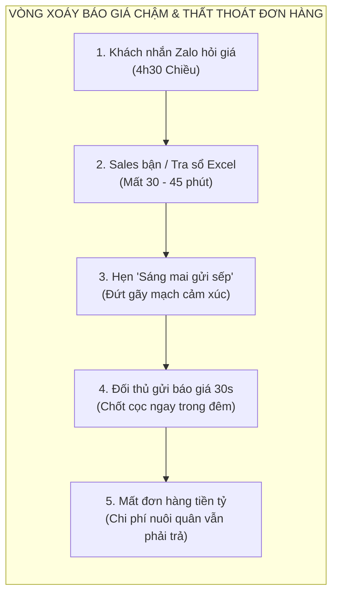
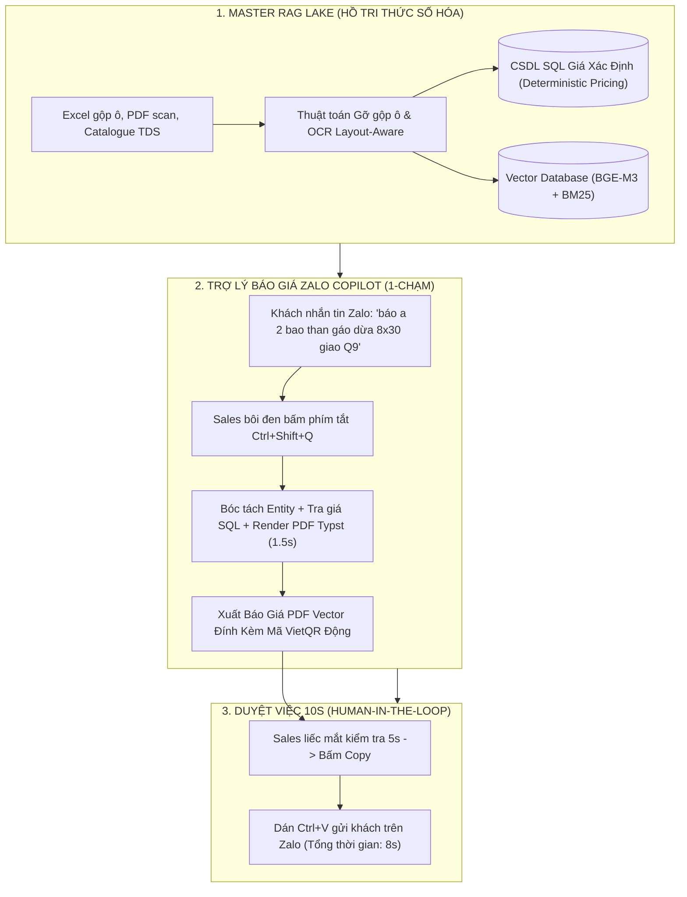

# Giải Mã "Tử Huyệt" Báo Giá Chậm 30 Phút: Vì Sao 68% Đơn Hàng B2B Bị Mất Và Cách Khắc Phục Bằng AI Agent

Trong thương trường B2B tại Việt Nam, đặc biệt là các ngành kỹ thuật, phân phối vật tư công nghiệp, van vòi, hóa chất và thiết bị M&E, có một quy luật bất thành văn: **Tốc độ phản hồi báo giá quyết định hơn 60% khả năng chốt đơn**.

Khách hàng doanh nghiệp, nhà thầu EPC hoặc trưởng phòng mua hàng thường gửi tin nhắn hỏi giá cùng lúc cho 3 nhà cung cấp trên Zalo. Nhà cung cấp nào gửi lại **Bản báo giá PDF chuẩn xác, rõ ràng về quy cách, chiết khấu và có mã thanh toán đầu tiên**, nhà cung cấp đó nắm giữ lợi thế đàm phán áp đảo.

Tuy nhiên, nghịch lý là hầu hết các doanh nghiệp SME hiện nay đều đang rơi vào **"cái bẫy báo giá chậm"**, tiêu tốn từ 30 phút đến nửa ngày cho một đơn hàng thông thường.

---

## 1. VÌ SAO BÁO GIÁ THỦ CÔNG ĐANG "BÀO MÒN" LỢI NHUẬN CỦA SME?

### 1.1. Dữ Liệu Phân Mảnh Và Bảng Giá "Sống" Trong Đầu Nhân Viên
Tại hầu hết các doanh nghiệp B2B vừa và nhỏ, dữ liệu không nằm trong một hệ thống tập trung mà rải rác ở:
* **Bảng giá Excel gộp ô (Merged cells):** Hàng trăm dòng sản phẩm với các tầng header lộn xộn, công thức ẩn và ghi chú viết tắt.
* **Tài liệu thông số kỹ thuật (TDS) & Catalogue:** Nằm ở dạng file PDF scan mờ hoặc catalogue giấy đóng gáy.
* **Chính sách chiết khấu ngầm:** Giá đại lý, giá khách quen, giá dự án nằm trong trí nhớ của Giám đốc hoặc một vài Sales kỳ cựu.

Khi nhân viên mới vào làm, họ mất ít nhất 3–6 tháng chỉ để học thuộc mã hàng. Mỗi lần khách hỏi giá, nhân viên phải mở 3–4 cửa sổ Excel, lật tài liệu TDS, dùng máy tính cầm tay bấm số rồi mới gõ lại vào file Word để xuất PDF.

### 1.2. Chi Phí Vận Hành "Nuôi Người" Đắt Đỏ
Theo khảo sát lương thị trường và Luật Bảo hiểm Xã hội hiện hành:
* Lương cứng 1 nhân viên hỗ trợ kinh doanh / báo giá: **11.000.000 – 13.000.000 VNĐ / tháng**.
* Chi phí thực tế của doanh nghiệp (Fully-loaded cost gồm BHXH 21.5%, thưởng Tết, máy móc, chỗ ngồi): **~18.000.000 – 19.300.000 VNĐ / tháng**.
* Nếu tuyển 2–3 nhân sự cho các mảng nội dung, báo giá và chăm sóc đa website, doanh nghiệp phải gánh quỹ lương cố định **40.000.000 – 60.000.000 VNĐ / tháng** mà rủi ro nhân sự nhảy việc vẫn luôn hiện hữu.

---

## 2. BƯỚC ĐỘT PHÁ TỪ KIẾN TRÚC AI AGENT OPERATIONS CỦA TRANG ANH AI

Thay vì ép doanh nghiệp mua các phần mềm CRM/ERP đắt đỏ và phức tạp (mà 48,8% doanh nghiệp từng áp dụng rồi phải bỏ cuộc theo số liệu của Bộ KH&ĐT), **TRANG ANH AI** triển khai mô hình **Hệ Thống AI Agent Vận Hành & Đồng Hành Chuyển Giao (Done-With-You)**:

### 2.1. Triệt Tiêu 100% Ảo Giác Bằng Master RAG Lake (Zero Hallucination)
Nhiều chủ doanh nghiệp e ngại: *"AI có bịa ra giá sai không?"*.
Trang Anh AI giải quyết triệt để vấn đề này bằng **Nguyên tắc Tách biệt Hoàn toàn (Strict Separation)**:
* Mô hình ngôn ngữ lớn (LLM) **chỉ đóng vai trò đọc hiểu ngôn ngữ tự nhiên** (bóc tách sản phẩm, số lượng, địa chỉ từ tin nhắn Zalo).
* Toàn bộ phép tính số học, đơn giá, chiết khấu và thuế VAT được xử lý bởi **Cơ Sở Dữ Liệu SQL Xác Định (Deterministic Pricing Database)**.
* **Kết quả:** Đơn giá chính xác 100%, không làm tròn sai, không bao giờ bịa giá.

### 2.2. Zalo Copilot 1-Chạm: An Toàn Tuyệt Đối, Không Can Thiệp API Zalo
* Không sử dụng bot can thiệp mã nguồn Zalo cá nhân (loại bỏ hoàn toàn nguy cơ bị Zalo khóa tài khoản).
* Nhân viên Sales chỉ cần bôi đen tin nhắn trên Zalo $\rightarrow$ Bấm phím tắt $\rightarrow$ Cửa sổ nổi hiển thị bảng giá nháp $\rightarrow$ Bấm Copy và gửi lại cho khách.
* Toàn bộ thao tác chỉ mất đúng **8 đến 15 giây**!

---

## 3. BẢNG SO SÁNH HIỆU SUẤT: TRUYỀN THỐNG VS TRANG ANH AI AGENT

| Tiêu Chí Vận Hành | Quy Trình Báo Giá Thủ Công | Ứng Dụng Trang Anh AI Agent |
|---|---|---|
| **Thời gian xuất 1 báo giá** | 15 – 45 phút / đơn hàng | **$\le 30$ giây** (Thao tác thực tế 8 giây) |
| **Độ chính xác thông số kỹ thuật** | Phụ thuộc vào trí nhớ của Sales | **Chính xác 100%** trích dẫn từ Master RAG Lake |
| **Hình thức báo giá** | File Excel thô hoặc gõ tin nhắn text | **PDF Vector sắc nét có logo + Mã VietQR động** |
| **Thời gian đào tạo nhân sự mới** | 3 – 6 tháng học thuộc sản phẩm | **Chỉ mất 1 ngày** (Thao tác 1 nút bấm) |
| **Chi phí vận hành hàng tháng** | 38 – 58 triệu (Nuôi 2–3 nhân sự) | **12.5 – 24 triệu VNĐ** (Tiết kiệm >50%) |
| **Tuân thủ pháp lý 2026** | Dễ rò rỉ dữ liệu cá nhân khách hàng | **Tuân thủ 100% Luật 91/2025 và Luật AI 134/2025** |

---

## 4. LỘ TRÌNH 4 TUẦN TRIỂN KHAI DONE-WITH-YOU: TỪ HỖN ĐỘN ĐẾN TỰ CHỦ

Doanh nghiệp không phải tự mày mò. Đội ngũ Kỹ sư Dữ liệu của Trang Anh AI trực tiếp đồng hành:
* **Tuần 1:** Thu thập dữ liệu thô, OCR tài liệu scan, chạy thuật toán gỡ gộp ô bảng giá Excel.
* **Tuần 2:** Xây dựng Master RAG Lake, kiểm thử 100 kịch bản hỏi giá thực tế.
* **Tuần 3:** Cài đặt Trợ lý Báo giá Zalo Copilot, kết nối Chatbot 24/7 và Dashboard CEO.
* **Tuần 4:** Đào tạo nhân sự 3 tầng (Daily Operator, Knowledge Maintainer, Supervisor), bàn giao SOP 1 trang và kích hoạt Go-Live.

---

## 5. KẾT LUẬN & ĐẶC QUYỀN DÀNH CHO DOANH NGHIỆP TIÊN PHONG

Trong kỷ nguyên cạnh tranh tốc độ, chậm 1 phút là mất 1 đơn hàng. Trang Anh AI mang đến chương trình:

> 🎁 **THE ULTIMATE ZERO-SETUP PARTNER PROGRAM:**
> * **Tài trợ miễn phí 100% Phí Khởi tạo Setup (Trị giá 20.000.000 VNĐ)** khi ký Hợp đồng Retainer Vận Hành 6 tháng.
> * **Bảo hành thương mại Ngày thứ 75 (QBR):** Hoàn tiền 100% nếu không giúp đội ngũ tiết kiệm tối thiểu 30 giờ/tháng.

👉 **Đăng ký nhận Bản Khám Sức Khỏe Vận Hành (1-Page Audit) và Đặt lịch Live Demo trên chính bảng giá của Quý Doanh nghiệp tại:**  
🔗 [TrangAnh.ai/giai-phap-ai-agent](https://tranganh.ai/giai-phap-ai-agent)
