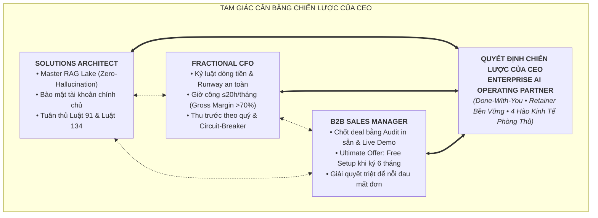
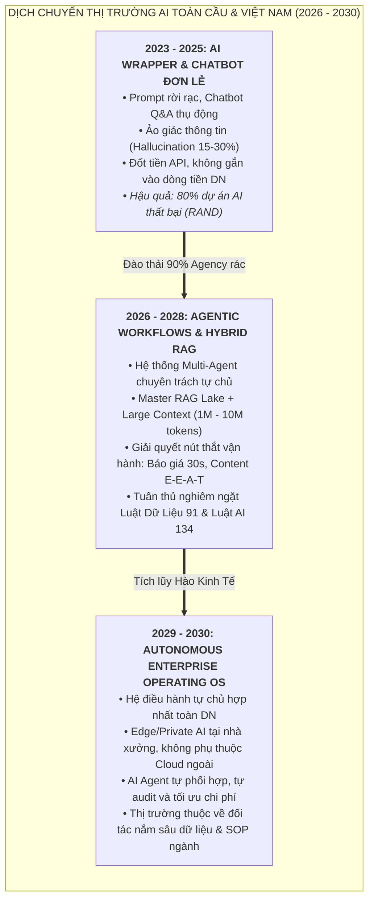
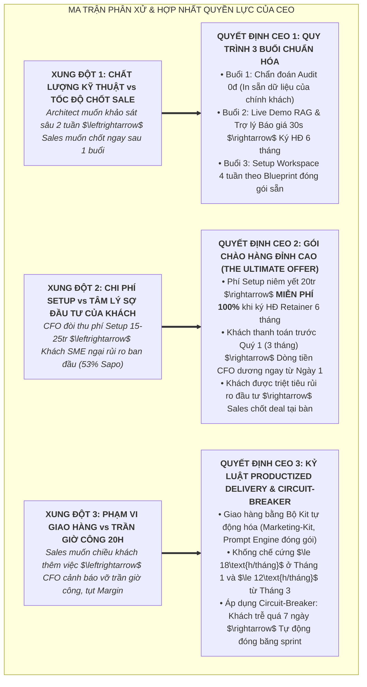
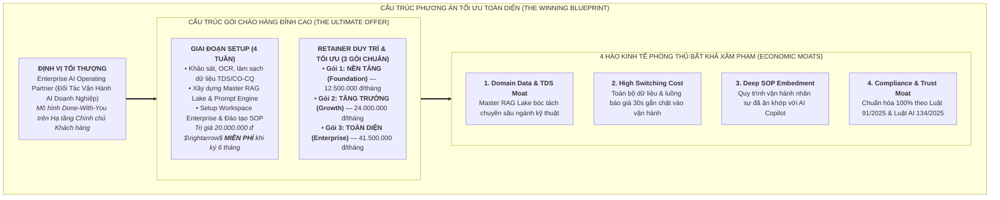
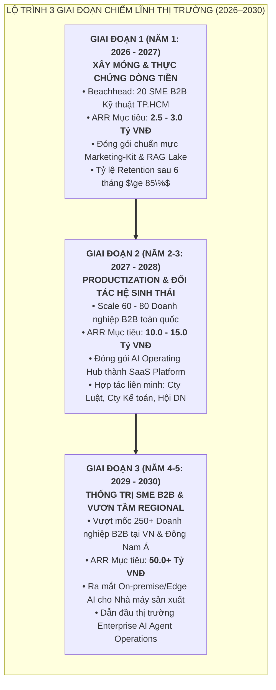

# TRANG ANH AI — BẢN QUYẾT ĐỊNH CHIẾN LƯỢC CỦA CEO & TẦM NHÌN 2026–2030
## THE OPTIMAL STRATEGIC BLUEPRINT: VẬN HÀNH DOANH NGHIỆP TỰ CHỦ TRÊN NỀN TẢNG AI AGENT

```text
======================================================================================================
   _____ ____      _    _   _  ____      _    _   _ _   _      _    ___ 
  |_   _|  _ \    / \  | \ | |/ ___|    / \  | \ | | | | |    / \  |_ _|
    | | | |_) |  / _ \ |  \| | |  _    / _ \ |  \| | |_| |   / _ \  | | 
    | | |  _ <  / ___ \| |\  | |_| |  / ___ \| |\  |  _  |  / ___ \ | | 
    |_| |_| \_\/_/   \_\_| \_|\____| /_/   \_\_| \_|_| |_| /_/   \_\___|
   TRANG ANH AI — TRANG BỊ QUY TRÌNH. TINH ANH VẬN HÀNH. (ELITE SYSTEMS. EASY GROWTH.)
   CEO STRATEGIC VISION & DECISION BLUEPRINT 2026–2030
======================================================================================================
```

> **Người ký ban hành:** Tổng Giám Đốc Chiến Lược & Chuyên Gia Tầm Nhìn AI (CEO & AI Strategic Visionary)  
> **Cơ quan ban hành:** Ban Lãnh Đạo Cấp Cao — **TRANG ANH AI VIETNAM**  
> **Phạm vi áp dụng:** Toàn bộ Hội Đồng Điều Hành, Solutions Architect, Fractional CFO, B2B Sales Lead và Khối Vận Hành  
> **Hiệu lực thi hành:** Kể từ ngày 30/08/2026 — Định hướng phát triển chiến lược giai đoạn 2026–2030  
> **Mục đích tài liệu:** Phân xử toàn diện các góc nhìn chuyên môn, xác lập định vị tối thượng, cấu trúc Gói Chào Hàng Đỉnh Cao (The Ultimate Offer), kiến tạo 4 Hào kinh tế phòng thủ và vạch rõ Lộ trình 3 Giai đoạn đưa TRANG ANH AI từ 0 lên vị thế dẫn đầu thị trường AI Vận hành Doanh nghiệp SME B2B tại Việt Nam và Đông Nam Á.

---

## Executive Summary (Thông Điệp Từ CEO)

Trong kỷ nguyên biến động dữ dội của Trí tuệ Nhân tạo 2026–2030, ranh giới giữa một doanh nghiệp tăng trưởng đột phá và một doanh nghiệp bị đào thải chỉ cách nhau đúng **một hệ thống vận hành**.

Cuộc chơi AI thế giới và Việt Nam đang bước vào giai đoạn **thanh lọc tàn khốc**:
* **90% AI Agency và các công ty bán tool "AI Wrapper" sẽ chết trong 24 tháng tới** vì chạy theo các chatbot hỏi-đáp hời hợt, không gắn vào luồng doanh thu và phá sản vì cuộc chiến hạ giá (race-to-the-bottom).
* **Doanh nghiệp SME Việt Nam (chiếm 98% nền kinh tế)** không cần thêm một phần mềm phức tạp để nhân viên bỏ xó, cũng không cần những lời hứa hẹn viển vông về thứ hạng SEO rủi ro. Họ cần một **Hệ Thống Vận Hành Tự Chủ (Autonomous Enterprise Operating Engine)** — nơi dữ liệu công ty được chuẩn hóa thành tài sản số, quy trình báo giá rút ngắn từ 30 phút xuống 30 giây, website và kênh số được nuôi dưỡng tự động bằng tri thức chuyên gia, và Ban Giám Đốc có Báo cáo Quản trị tức thì để ra quyết định sống còn.

**TRANG ANH AI không sinh ra để làm một agency tiếp thị thuê ngoài, cũng không làm công ty gia công phần mềm giá rẻ.**  
Chúng tôi định vị là **Đối Tác Kiến Trúc & Vận Hành Hệ Điều Hành AI Doanh Nghiệp (Enterprise AI Operating Partner)** theo mô hình **Done-With-You (Đồng hành kiến trúc & chuyển giao)**. 

Bản Quyết Định Chiến Lược này là kim chỉ nam tối cao tổng hòa giữa **Sự chuẩn xác kỹ thuật tuyệt đối (Architect)**, **Kỷ luật dòng tiền & Biên lợi nhuận thép (CFO)**, và **Đòn bẩy bán hàng bẻ gãy mọi từ chối (Sales)** để xây dựng một cỗ máy kinh doanh có dòng tiền dương ngay từ Quý 1, kiến tạo hào kinh tế bền vững và vươn lên vị thế dẫn đầu thị trường trong 5 năm tới.



---

# PHẦN 1: BỨC TRANH TOÀN CẢNH THỊ TRƯỜNG AI AGENT 2026–2030 (TẦM NHÌN 2–5 NĂM)



## 1.1. Sự Thoái Trào Của "AI Wrapper / Chatbot Rời Rạc" & Sự Trỗi Dậy Của "Autonomous Enterprise Operating Engine"

1. **Sự sụp đổ của ảo tưởng Prompting & Chatbot tĩnh (2023–2025):**
   * Trong giai đoạn đầu của GenAI, hàng loạt startup và agency mọc lên chỉ với một lớp giao diện (wrapper) bọc quanh API của OpenAI/Anthropic để bán chatbot trả lời tự động hoặc công cụ viết content hàng loạt.
   * **Thực tế phũ phàng đã được chứng minh bằng số liệu thực chứng:**
     * Nghiên cứu của **RAND (2024)** chỉ ra: Hơn **80% dự án AI thất bại** — cao gấp đôi tỷ lệ thất bại của các dự án IT truyền thống.
     * Khảo sát của **BCG (2025)** trên 1.250 doanh nghiệp toàn cầu: **60% công ty thu được rất ít hoặc không có giá trị từ AI**; chỉ 5% đạt được giá trị ở quy mô vận hành.
     * Hiện tượng **"Workslop"** (BetterUp Labs & Stanford, HBR 2025): 41% nhân sự nhận phải các văn bản AI tạo ra trông có vẻ trau chuốt nhưng sai lệch bản chất kỹ thuật, làm tiêu tốn trung bình **1 giờ 56 phút** của nhân sự cấp cao để sửa chữa, khiến 42% khách hàng đánh mất niềm tin vào thương hiệu.
     * Vụ việc điển hình: **Klarna (2024–2025)** sa thải 700 nhân sự CSKH để thay bằng AI, nhưng đến năm 2025 buộc phải âm thầm tuyển dụng lại vì suy giảm chất lượng dịch vụ khách hàng nghiêm trọng.

2. **Kỷ nguyên mới: Autonomous Enterprise Operating Engine (2026–2030):**
   * Doanh nghiệp B2B không trả tiền để "chat với AI". Họ trả tiền để **loại bỏ nút thắt vận hành**.
   * Thị trường chuyển dịch từ **Passive Chatbot** (chờ con người hỏi mới trả lời) sang **Active Agentic Workflows** (AI Agent chủ động lắng nghe sự kiện, bóc tách dữ liệu từ Zalo/Email, truy vấn kho dữ liệu kỹ thuật chuẩn xác, tạo bản nháp Báo giá/BOQ, gửi thông báo phê duyệt cho con người và cập nhật CRM/Dashboard theo thời gian thực).
   * Doanh nghiệp chiến thắng là doanh nghiệp sở hữu **Hệ điều hành vận hành thông minh**, kết nối đa phòng ban thành một dòng chảy dữ liệu thống nhất (Workflow Alignment).

---

## 1.2. Cuộc Cách Mạng Công Nghệ: Context Window Khổng Lồ, Multimodal Native, Edge/Private AI & Biến Động Pháp Lý

```text
+---------------------------------------------------------------------------------------------------+
|                     4 ĐỘNG LỰC CÔNG NGHỆ & PHÁP LÝ TÁI CẤU TRÚC CUỘC CHƠI (2026–2030)              |
+---------------------------------------------------------------------------------------------------+
| 1. LARGE CONTEXT (1M - 10M TOKENS) & HYBRID RAG:                                                  |
|    Khả năng nạp toàn bộ lịch sử giao dịch 5 năm, 500 catalogue TDS và toàn bộ quy chuẩn QCVN/ASTM  |
|    vào bộ nhớ làm việc. RAG không còn là vector search đơn giản mà kết hợp Hybrid Search +        |
|    Knowledge Graph, triệt tiêu hoàn toàn ảo giác (Zero Hallucination).                            |
|                                                                                                   |
| 2. NATIVE MULTIMODAL (AUDIO - IMAGE - CAD - VIDEO):                                               |
|    AI tiếp nhận trực tiếp bản vẽ CAD, hình ảnh hiện trường nhà xưởng, hóa đơn scan và voice memo   |
|    từ Zalo để bóc tách thông số kỹ thuật và tạo dự toán BOQ trong 2 phút.                          |
|                                                                                                   |
| 3. ON-PREMISE / EDGE PRIVATE AI CHO KHỐI CÔNG NGHIỆP:                                             |
|    Mô hình SLMs (Small Language Models như Llama 3.x, DeepSeek, Qwen) chạy trực tiếp tại Server   |
|    nội bộ hoặc thiết bị Edge tại nhà máy, bảo mật 100% công thức pha chế và bảng giá mật.         |
|                                                                                                   |
| 4. BỨC TƯỜNG PHÁP LÝ: LUẬT DỮ LIỆU 91/2025 & LUẬT AI 134/2025:                                     |
|    Buộc mọi hệ thống AI phải minh bạch, lưu log vận hành, gán nhãn máy đọc và giữ cơ chế          |
|    Human-in-the-loop. Doanh nghiệp vi phạm chuyển dữ liệu bị phạt tới 5% doanh thu.                |
+---------------------------------------------------------------------------------------------------+
```

1. **Context Window Siêu Lớn (1M – 10M Tokens) & Hybrid RAG:**
   * Không còn rào cản chia nhỏ văn bản (chunking) rời rạc làm mất ngữ cảnh. Toàn bộ hồ sơ thầu, tiêu chuẩn ngành, hàng trăm catalogue sản phẩm được nạp vào không gian làm việc của Agent.
   * Kết hợp Semantic Search với Structured SQL Querying để trích xuất số liệu kỹ thuật chính xác đến từng chữ số thập phân.

2. **Multimodal Native — Giao diện tự nhiên của khối B2B Kỹ thuật:**
   * Kỹ sư hiện trường không gõ phím, họ chụp ảnh tem nhãn máy móc, gửi file bản vẽ sơ đồ công nghệ hoặc gửi tin nhắn thoại Zalo.
   * AI Agent phân tích âm thanh, hình ảnh, văn bản đa kênh và chuyển hóa thành dữ liệu có cấu trúc ngay lập tức.

3. **Edge / Private AI cho Nhà máy & Xưởng sản xuất:**
   * Trong giai đoạn 2027–2030, các doanh nghiệp sản xuất gia công, hóa chất, cơ khí chính xác sẽ không chấp nhận đẩy bí quyết kinh doanh (Trade Secrets) lên Cloud công cộng.
   * Khả năng đóng gói Agent chạy trên hạ tầng Private Cloud hoặc Local Server chính là vũ khí tối thượng của TRANG ANH AI.

4. **Biến động Pháp lý Việt Nam — Bộ đôi lá chắn bắt buộc:**
   * **Luật Bảo vệ Dữ liệu Cá nhân số 91/2025/QH15 & Nghị định 356/2025/NĐ-CP (Hiệu lực 01/01/2026):** Quy định xử lý dữ liệu tài chính, khách hàng và chuyển dữ liệu xuyên biên giới. Mức phạt lên tới **5% tổng doanh thu** năm trước.
   * **Luật Trí tuệ Nhân tạo số 134/2025/QH15 (Hiệu lực 01/03/2026):** Buộc phân loại rủi ro, gán nhãn nội dung AI ở định dạng máy đọc được, lưu trữ log kỹ thuật suốt vòng đời và **bắt buộc duy trì sự giám sát của con người (Human-in-the-loop)**.
   * *Nhận định CEO:* Luật pháp không phải rào cản — Luật pháp là chiếc rây lọc vĩ đại quét sạch 90% đối thủ làm ăn chộp giật ra khỏi thị trường.

---

## 1.3. Tại Sao 90% AI Agency Tại Việt Nam Sẽ Chết Trong 24 Tháng Tới?

Báo cáo của **Gartner (2025)** đã đưa ra dự báo chấn động: **Hơn 40% dự án Agentic AI toàn cầu sẽ bị hủy bỏ trước cuối năm 2027** do hiện tượng "Agent Washing" (gắn mác agent nhưng bản chất là bot ngớ ngẩn). Tại Việt Nam, tỷ lệ đào thải của các AI Agency sẽ lên tới **90%** vì 4 nguyên nhân chí tử:

| Điểm Chết Của AI Agency Truyền Thống | Thực Trạng Thị Trường Việt Nam | Giải Pháp Cứu Cánh & Vị Thế Của TRANG ANH AI |
|---|---|---|
| **1. Bẫy "Tool Vendor & Prompt Selling"** | Bán tài khoản công cụ hoặc các bộ prompt copy trên mạng. Khách hàng dùng 2 tuần thấy vô dụng và hủy gói ngay lập tức. | **Xây dựng Hệ Thống Vận Hành Tùy Biến (SOP Embedded):** Nhúng sâu vào luồng công việc nội bộ của khách, biến AI thành mắt xích không thể tách rời. |
| **2. Bẫy "Race-To-The-Bottom" Về Giá** | Đua nhau hạ giá viết bài SEO (150k–200k/bài) hoặc bán chatbot 500k/tháng. Doanh thu không bù nổi chi phí hỗ trợ, dẫn tới phá sản. | **Định Vị Cao Cấp (High-Value Retainer 12.5tr – 41.5tr/tháng):** Không bán số lượng bài rác, bán năng lực giải phóng nhân sự và tốc độ chốt đơn B2B. |
| **3. Bị SaaS Lớn Nuốt Chửng (SaaS Cannibalization)** | Các phần mềm quản trị (như 1Office tích hợp 8 AI Agent, MISA tích hợp AI) nuốt trọn các tác vụ quản trị văn phòng cơ bản. | **Tập Trung Ngách B2B Công Nghiệp & Kỹ Thuật:** Nơi đòi hỏi hiểu biết sâu về TDS, CO/CQ, bảng dự toán BOQ và bí quyết công nghệ — thứ SaaS đại trà không bao giờ làm được. |
| **4. Thiếu Kỷ Luật Bằng Chứng & Phạm Vi Pháp Lý** | Cam kết bừa bãi về thứ hạng từ khóa Google, vi phạm bản quyền dữ liệu và không tuân thủ Luật AI 134/2025. | **Kiến Trúc Tài Khoản Chính Chủ & Zero-Hallucination:** Dữ liệu thuộc về khách hàng 100%, tuân thủ pháp lý ngay từ dòng code đầu tiên. |

> **Chân lý của CEO:** *Người sống sót duy nhất sau đợt thanh lọc 2026–2028 là đơn vị không bán AI như một món đồ chơi công nghệ, mà bán AI như một **Hạ Tầng Năng Suất Doanh Nghiệp (Enterprise Productivity Infrastructure)** gắn chặt với dòng tiền của khách hàng.*

---

# PHẦN 2: PHÂN XỬ & TỔNG HÒA 3 GÓC NHÌN (ARCHITECT vs CFO vs SALES MANAGER)

Là Tổng Giám Đốc, tôi đã lắng nghe và phân tích sâu sắc bản phản biện từ 3 trụ cột của công ty:
* **Solutions Architect:** Đòi hỏi chuẩn mực kỹ thuật cao nhất, kiến trúc Hub-and-Spoke, bảo mật dữ liệu tuyệt đối trên tài khoản Enterprise chính chủ của khách, triệt tiêu ảo giác bằng Hybrid RAG, tuân thủ Luật 91 & Luật 134.
* **Fractional CFO:** Đòi hỏi kỷ luật dòng tiền thép, bảo vệ runway an toàn, khống chế giờ công giao hàng $\le 20\text{ giờ/tháng/khách}$ để đạt Gross Margin $>70\%$, xóa bỏ mọi cam kết rủi ro ngoại cảnh (SEO rank/lead ảo), áp dụng hợp đồng 6 tháng thu trước và cơ chế Circuit-Breaker đóng băng dự án nếu khách chậm trễ.
* **B2B Sales Manager:** Đòi hỏi tốc độ chốt deal nhanh, vũ khí bán hàng trực quan (Audit in sẵn, Khoảnh khắc ChatGPT, Demo content 30s, Demo báo giá 30s), chính sách đòn bẩy giá hấp dẫn (Miễn phí Setup khi ký Retainer 6 tháng) để bẻ gãy sự trì hoãn của các chủ doanh nghiệp SME truyền thống.



---

## 2.1. Phân Xử Xung Đột 1: Chất Lượng Kỹ Thuật (Zero-Hallucination) $\leftrightarrow$ Tốc Độ Chốt Deal (Sales Velocity)

* **Phân xử của CEO:**
  * Sales **tuyệt đối không được bán hứa viển vông** về những tính năng kỹ thuật chưa hoàn thiện (như cam kết bot tự trả lời trực tiếp trên Zalo cá nhân — nơi không có API chính thức và vi phạm chính sách của Zalo).
  * Định vị lại H2 thành **"Trợ Lý Báo Giá Sales Copilot"** (Sales là người bấm nút gửi cuối cùng) như Solutions Architect đề xuất. Điều này thỏa mãn 100% nguyên tắc **Human-in-the-loop của Luật AI 134/2025**, xóa bỏ hoàn toàn nỗi sợ "bot báo nhầm giá làm mất khách", đồng thời cắt giảm thời gian demo từ 5 ngày xuống còn 1 ngày.
  * Sales sử dụng **Bản Audit Chẩn Đoán In Sẵn** và **Khoảnh khắc ChatGPT** làm mũi khoan phá vỡ hoài nghi. Khi khách nhìn thấy lỗ hổng dữ liệu của chính mình, họ mua vì *nhu cầu sửa chữa có phương pháp*, chứ không phải mua vì lời tán dương công nghệ.

---

## 2.2. Phân Xử Xung Đột 2: Kỷ Luật Dòng Tiền (CFO) $\leftrightarrow$ Tâm Lý E Ngại Chi Phí Ban Đầu (Sales)

* **Phân tích số liệu thực chứng:** Báo cáo của **UOB (2026)** và **Sapo (2026)** chỉ ra rằng **49% – 53.3% doanh nghiệp SME e ngại chi phí đầu tư công nghệ ban đầu quá cao**. Nếu ép thu ngay 20 triệu phí Setup mà chưa chứng minh được giá trị, chu kỳ bán hàng sẽ kéo dài từ 2 tuần lên 3 tháng và tỷ lệ rớt deal lên tới 70%.
* **Quyết định của CEO — Cú Đòn Bẫy "Free Setup On Commitment":**
  * Chúng ta định giá Phí Khởi Tạo & AI-hóa Dữ Liệu (Setup & Master RAG Lake) là **20.000.000 VNĐ**.
  * **Chính sách kích hoạt tối thượng:** **TẶNG MIỄN PHÍ 100% PHÍ SETUP (Trị giá 20tr)** cho khách hàng ký Hợp đồng Retainer kỳ hạn chuẩn **06 tháng (02 Quý)** và thanh toán trước **Quý đầu tiên (3 tháng)**.
  * **Lợi ích 3 bên cùng thắng (Win-Win-Win):**
    * **Khách hàng:** Cảm thấy nhận được một món hời lớn (tiết kiệm ngay 20 triệu chi phí ban đầu), rào cản tài chính bị gỡ bỏ hoàn toàn.
    * **Sales Lead:** Sở hữu vũ khí chốt deal tối thượng ngay tại Buổi 2 ("Chỉ dành cho 5 đối tác đầu tiên trong tháng này").
    * **Fractional CFO:** Dòng tiền thu về ngay lập tức $3\text{ tháng} \times 12.5\text{tr} = 37.5\text{ triệu VNĐ}$ (hoặc $3\text{ tháng} \times 24\text{tr} = 72\text{ triệu VNĐ}$ cho gói Tăng trưởng). Dòng tiền thực dương ngay từ Ngày 1, loại bỏ 100% rủi ro bị quỵt nợ hoặc khách bỏ ngang sau 1 tháng.

---

## 2.3. Phân Xử Xung Đột 3: Phạm Vi Giao Hàng & Trách Nhiệm Pháp Lý $\leftrightarrow$ Khống Chế Giờ Công $\le 20\text{h}$

* **Phân xử của CEO:**
  * Toàn bộ quy trình giao hàng phải tuân thủ nghiêm ngặt **"Luật Số 2"**: *Chỉ xây dựng module công cụ khi có ít nhất 2 khách hàng trả tiền cùng yêu cầu*. Tuyệt đối không tùy biến vô tội vạ làm phình to giờ công (Scope Creep).
  * Ứng dụng triệt để **Productized Delivery Engine (Marketing-Kit & Prompt Blueprints)**:
    * Tháng 1 (Setup & Onboarding): Giờ công tối đa **18 giờ/khách**.
    * Tháng 2: Giờ công tối đa **14 giờ/khách**.
    * Từ Tháng 3 trở đi: Giờ công tự động hóa kéo giảm xuống còn **8 – 10 giờ/khách**.
    * $\rightarrow$ **Biên lợi nhuận gộp (Gross Margin) đạt trên 72% – 80%**, hoàn toàn giải tỏa áp lực cho bộ máy kỹ thuật 3 người.
  * **Thiết lập Điều khoản SLA & Circuit-Breaker đanh thép trong Hợp đồng:** Nếu khách hàng chậm duyệt nội dung hoặc chậm cung cấp thông số TDS quá **07 ngày làm việc**, sprint sẽ tự động đóng băng (Freeze). Chi phí tháng đó vẫn được tính đầy đủ để giữ phân bổ tài nguyên kỹ thuật. Điều này ngăn chặn triệt để tình trạng dự án bị ngâm làm tồn đọng nguồn lực của công ty.

---

# PHẦN 3: PHƯƠNG ÁN TỐI ƯU TOÀN DIỆN CỦA CEO (THE WINNING STRATEGIC BLUEPRINT)



---

## 3.1. Định Vị Tối Thượng: Enterprise AI Operating Partner

TRANG ANH AI xác lập vị thế độc tôn trên thị trường:
1. **Không phải Tool Vendor:** Chúng tôi không bán phần mềm tĩnh đóng gói đại trà.
2. **Không phải Traditional Outsourced Agency:** Chúng tôi không làm thuê lắt nhắt từng bài viết hay chạy quảng cáo đốt tiền ngắn hạn.
3. **CHÚNG TÔI LÀ ĐỐI TÁC KIẾN TRÚC & VẬN HÀNH HỆ ĐIỀU HÀNH AI DOANH NGHIỆP (Enterprise AI Operating Partner):**
   * Đồng hành theo phương thức **Done-With-You**: Chúng tôi cùng doanh nghiệp làm sạch dữ liệu, kiến tạo cỗ máy tự chủ, đào tạo nhân sự nội bộ làm chủ công nghệ và duy trì vận hành tối ưu định kỳ.
   * **Triết lý:** *"Trang bị quy trình. Tinh anh vận hành." (Elite Systems. Easy Growth.)*

---

## 3.2. Cấu Trúc Gói Chào Hàng Đỉnh Cao (The Ultimate Offer)

### Bảng Cơ Cấu 3 Gói Dịch Vụ Retainer Chuẩn Hóa:

| Hạng mục Quyền lợi & Tính năng | GÓI 1: NỀN TẢNG (Foundation Operations) | GÓI 2: TĂNG TRƯỞNG (Growth Multi-Site & Sales Copilot) | GÓI 3: TOÀN DIỆN (Enterprise Multi-Agent Ecosystem) |
|---|---|---|---|
| **Mức Phí Retainer Đầu Tư** | **12.500.000 VNĐ** */ tháng* | **24.000.000 VNĐ** */ tháng* *(Gói Chủ Lực)* | **41.500.000 VNĐ** */ tháng* |
| **Phí Setup & Master RAG Lake** | 20.000.000 đ $\rightarrow$ **MIỄN PHÍ** khi ký 6 tháng | 25.000.000 đ $\rightarrow$ **MIỄN PHÍ** khi ký 6 tháng | 35.000.000 đ $\rightarrow$ **MIỄN PHÍ** khi ký 6 tháng |
| **Kỳ hạn Hợp đồng & Thanh toán** | 06 tháng (Thu trước theo Quý: 37.5tr) | 06 tháng (Thu trước theo Quý: 72.0tr) | 06 tháng (Thu trước theo Quý: 124.5tr) |
| **Quy mô Website Quản trị** | 01 Website chính | **1 – 3 Website vệ tinh tập trung** | **3 – 5+ Website vệ tinh không giới hạn** |
| **Master RAG Lake & Kiến trúc Tri thức** | Cập nhật định kỳ Catalogue, TDS, Bảng giá hàng tháng | Cập nhật Real-time + Phân luồng dữ liệu đa kênh | Master Data Lake toàn diện + Hybrid Semantic Search |
| **Contextual Content Engine** | 8 – 12 bài chuyên sâu E-E-A-T / tháng | 16 – 24 bài E-E-A-T phân luồng đa site | 30+ bài E-E-A-T + Tài liệu kỹ thuật chuyên sâu |
| **Tối ưu Hiện diện AI Search (GEO)** | Tối ưu hóa Entity & Schema cho LLM | Tối ưu GEO + Đo lường trích dẫn định kỳ | Chiếm lĩnh trích dẫn ngành trên AI Search |
| **Trợ Lý Báo Giá B2B Sales Copilot** | — | **Xuất file Báo giá PDF chuẩn trong 30s** | Báo giá 30s + Chiết khấu đa tầng tự động |
| **AI Sales & CSKH Chatbot (24/7)** | LiveChat Website cơ bản | **LiveChat Web + Fanpage + Zalo OA (RAG)** | Hệ thống CSKH Đa kênh + Tự động phân loại Deal |
| **Executive BI Copilot (Dashboard CEO)** | Báo cáo 1 trang tóm tắt chỉ số tháng | **Dashboard 1 Trang tức thì + Phân tích nghẽn** | Executive BI Dashboard + Mô phỏng kịch bản What-If |
| **Engineering BOQ & Dự toán kỹ thuật** | — | — | **Lập bảng BOQ vật tư & thủy lực trong 2 phút** |
| **AI Tender & Bidding Copilot** | — | — | **Bóc tách HSMT & Soạn HSĐXKT trong 30 phút** |
| **SLA Hỗ trợ Kỹ thuật & Tối ưu** | 48 giờ làm việc | **24 giờ làm việc + Họp QBR Quý** | **Hỗ trợ ưu tiên 4 giờ + Cố vấn chiến lược 1-1** |
| **Giá trị quy đổi nhân sự tương đương** | 1 Content Specialist (~13.4tr/tháng) | 1 Sales Admin + 1 Content + 1 SEO (~35tr/tháng) | Cả phòng Kỹ thuật + Marketing + Thầu (~70tr/tháng) |

---

## 3.3. Xây Dựng 4 Hào Kinh Tế Phòng Thủ Bất Khả Xâm Phạm (Economic Moats)

Để đảm bảo TRANG ANH AI không thể bị sao chép bởi các công ty công nghệ lớn hay các agency giá rẻ, chúng ta thiết lập **4 lớp hào phòng thủ vững chắc**:

```text
+---------------------------------------------------------------------------------------------------+
|                     4 LỚP HÀO KINH TẾ PHÒNG THỦ (THE 4-TIER ECONOMIC MOAT SYSTEM)                  |
+---------------------------------------------------------------------------------------------------+
| [HÀO 1] DOMAIN DATA & TECHNICAL SPECIFICATION MOAT:                                              |
| • Chúng ta nắm giữ cấu trúc dữ liệu kỹ thuật B2B sâu sắc (chỉ số than hoạt tính Iodine, xử lý nước|
|   thải, tiêu chuẩn ASTM/QCVN, bóc tách vật tư cơ khí, hóa chất).                                 |
| • Đây là dữ liệu ngách không có sẵn trên Internet công cộng. LLM phổ thông nếu không có RAG Lake  |
|   của Trang Anh AI sẽ bị ảo giác 100%. Đối thủ mất hàng năm mới tích lũy được.                    |
|                                                                                                   |
| [HÀO 2] HIGH SWITCHING COST (CHI PHÍ CHUYỂN ĐỔI CỰC CAO):                                         |
| • Khi toàn bộ bảng giá, quy tắc chiết khấu, lịch sử khách hàng và mẫu báo giá PDF đã được nhúng  |
|   vào hệ thống Trang Anh Agent, việc tháo dỡ AI sẽ khiến đội ngũ Sales bị tê liệt ngay lập tức.   |
| • Rời bỏ Trang Anh AI đồng nghĩa với việc doanh nghiệp phải tuyển thêm 2–3 nhân sự với chi phí    |
|   gấp đôi để làm lại các tác vụ thủ công.                                                         |
|                                                                                                   |
| [HÀO 3] DEEP SOP EMBEDMENT (NHÚNG SÂU VÀO VĂN HÓA VẬN HÀNH):                                      |
| • Đào tạo 4 tuần trong gói Setup biến nhân viên khách hàng thành "Người phê duyệt AI" quen tay.   |
| • Khi nhân viên đã quen với việc nhận bản nháp 95% và chỉ mất 10s duyệt bài/báo giá, họ sẽ tạo   |
|   ra sự kháng cự mãnh liệt nếu Ban Giám Đốc muốn quay lại quy trình gõ phím thủ công ngày xưa.    |
|                                                                                                   |
| [HÀO 4] LEGAL & PRIVACY COMPLIANCE MOAT:                                                          |
| • Kiến trúc "Tài khoản Enterprise chính chủ" giúp khách hàng tuân thủ trọn vẹn Luật Bảo vệ Dữ Liệu|
|   91/2025/QH15 và Luật AI 134/2025/QH15. Hồ sơ tuân thủ minh bạch trở thành tấm vé thông hành    |
|   cho khách hàng khi làm việc với các đối tác FDI và cơ quan quản lý nhà nước.                    |
+---------------------------------------------------------------------------------------------------+
```

---

# PHẦN 4: LỘ TRÌNH 3 GIAI ĐOẠN VƯƠN LÊN VỊ THẾ DẪN ĐẦU (2026–2030)



---

## 4.1. Giai Đoạn 1 (Năm 1: 2026–2027) — Xây Móng Beachhead & Xác Lập 20 Khách Hàng Pilot Đầu Tiên

* **Mục tiêu tối thượng:** Chinh phục **20 khách hàng B2B Pilot trả phí** tại TP.HCM.
* **Chỉ số Tài chính:**
  * Doanh thu định kỳ hàng tháng (MRR): **220 – 260 triệu VNĐ/tháng**.
  * Doanh thu định kỳ hàng năm (ARR): **2.5 – 3.0 Tỷ VNĐ**.
  * Gross Margin: **$\ge 75\%$**. Net Profit Margin: **$\ge 40\%$**.
* **Trọng tâm hành động chiến lược:**
  1. **Tập trung tuyệt đối vào Beachhead:** SME B2B Kỹ thuật, Môi trường, Hóa chất, Thiết bị cơ khí, Vật tư công nghiệp tại TP.HCM và các khu công nghiệp lân cận (Bình Dương, Đồng Nai).
  2. **Quy trình bán hàng Founder-Led:** Sử dụng Bản Audit in sẵn về chính khách hàng + Khoảnh khắc ChatGPT + Demo Trợ lý Báo giá 30s.
  3. **Áp dụng chính sách Ultimate Offer:** Free Setup khi ký Hợp đồng Retainer 6 tháng thu trước Quý 1.
  4. **Kỷ luật vận hành:** Chuẩn hóa quy trình bàn giao SOP, khống chế giờ công $\le 12\text{h/khách/tháng}$ từ tháng thứ 3 nhờ Productized Marketing-Kit.
  5. **Xây dựng cỗ máy Referral tự động:** Mỗi khách hàng bàn giao báo cáo tháng đầu tiên thu về tối thiểu 2 lời giới thiệu đối tác cùng ngành.

---

## 4.2. Giai Đoạn 2 (Năm 2–3: 2027–2028) — Sản Phẩm Hóa Nền Tảng (Productization) & Mở Rộng Kênh Đối Tác

* **Mục tiêu tối thượng:** Mở rộng quy mô phục vụ **60 – 80 Doanh nghiệp B2B** trên toàn quốc; đóng gói cỗ máy vận hành thành nền tảng phần mềm dịch vụ (Productized AI Operating Platform).
* **Chỉ số Tài chính:**
  * Doanh thu định kỳ hàng tháng (MRR): **900 triệu – 1.25 Tỷ VNĐ/tháng**.
  * Doanh thu định kỳ hàng năm (ARR): **10.0 – 15.0 Tỷ VNĐ**.
  * Đạt điểm cân bằng tài chính mở rộng và tái đầu tư vào R&D công nghệ lõi.
* **Trọng tâm hành động chiến lược:**
  1. **Đóng gói Platform (Trang Anh AI Operating OS v1.0):** Chuyển hóa toàn bộ các kịch bản n8n, Prompt Engine và RAG Vector Hub thành một Dashboard SaaS trực quan, giúp khách hàng tự quản trị và theo dõi hiệu suất Agent.
  2. **Mở rộng sang các Module chuyên sâu:** 
     * **AI Tender & Bidding Copilot:** Bóc tách HSMT và lập hồ sơ thầu cho các nhà thầu cơ điện, xây dựng công nghiệp.
     * **Engineering & BOQ Estimator:** Dự toán khối lượng kỹ thuật tự động cho xưởng sản xuất.
  3. **Xây dựng Mạng Lưới Đối Tác Chiến Lược (Channel Partners):**
     * Hợp tác với các Công ty Luật Doanh nghiệp (bán chéo gói Tuân thủ Luật AI 134).
     * Hợp tác với các Đơn vị Tư vấn Quản trị & Kế toán Thuế (bán kèm giải pháp tự động hóa vận hành).
     * Liên kết với các Hiệp hội Doanh nghiệp Công nghiệp & Khu Chế Xuất để tổ chức các buổi Chẩn đoán Sức Khỏe Digital quy mô ngành.

---

## 4.3. Giai Đoạn 3 (Năm 4–5: 2029–2030) — Thống Trị Thị Trường SME B2B & Vươn Ra Khu Vực Đông Nam Á

* **Mục tiêu tối thượng:** Thiết lập vị thế **Top 1 Đơn vị Vận Hành AI Agent cho Doanh Nghiệp SME B2B tại Việt Nam** và mở rộng ra thị trường khu vực (Thái Lan, Indonesia, Malaysia) với quy mô **250+ Doanh nghiệp Enterprise & SME**.
* **Chỉ số Tài chính:**
  * Doanh thu định kỳ hàng năm (ARR): **50.0+ Tỷ VNĐ (2.0M+ USD)**.
  * Định giá doanh nghiệp kỳ vọng: **15 – 20 Triệu USD**.
* **Trọng tâm hành động chiến lược:**
  1. **Thương mại hóa Enterprise On-premise / Edge Private AI:** Cung cấp các trạm AI Appliance phần cứng cắm tại nhà máy, vận hành độc lập không cần Internet, phục vụ các tập đoàn sản xuất bảo mật cao.
  2. **Multi-Agent Autonomous Orchestration:** Hệ thống các Agent tự động giao tiếp và tối ưu hóa toàn bộ chuỗi cung ứng: Từ Dự báo nhu cầu thị trường $\rightarrow$ Tự động tạo báo giá $\rightarrow$ Tự động đặt hàng nhà máy $\rightarrow$ Tự động rà soát pháp lý hợp đồng.
  3. **Mở rộng Regional (Đông Nam Á):** Bản địa hóa nền tảng sang tiếng Anh, tiếng Thái và tiếng Bahasa, mang kinh nghiệm thực chiến B2B công nghiệp phục vụ toàn bộ chuỗi cung ứng Đông Nam Á.

---

# LỜI TUYÊN THỆ HÀNH ĐỘNG CỦA HỘI ĐỒNG ĐIỀU HÀNH

```text
======================================================================================================
                              LỜI CAM KẾT HÀNH ĐỘNG CỦA CEO & BAN LÃNH ĐẠO
======================================================================================================
1. CHÚNG TA KHÔNG ĐI BÁN ẢO TƯỞNG CÔNG NGHỆ: 
   Mọi dòng code, mọi agent triển khai đều phải quy đổi ra giờ công tiết kiệm thật, tốc độ báo giá 30s
   và dòng tiền tăng trưởng thực chứng cho khách hàng.

2. KỶ LUẬT TÀI CHÍNH LÀ LÁ CHẮN TỒN TÙY: 
   Không bao giờ đánh đổi biên lợi nhuận lấy tăng trưởng ảo. Thu tiền trước theo quý, kiểm soát giờ công
   thép và tái đầu tư vào tài sản số tái sử dụng.

3. KHÁCH HÀNG LÀ ĐỒNG ĐỘI CHIẾN LƯỢC: 
   Done-With-You là lời hứa đồng hành. Chúng ta trang bị cho doanh nghiệp Việt một bộ não vận hành tự chủ,
   giúp họ vươn lên làm chủ tương lai trong kỷ nguyên AI 2026–2030!
======================================================================================================
```

**TỔNG GIÁM ĐỐC CHIẾN LƯỢC & CHUYÊN GIA TẦM NHÌN AI**  
*(Đã ký và phê chuẩn toàn bộ kế hoạch thực thi)*  
**TRANG ANH AI VIETNAM**
